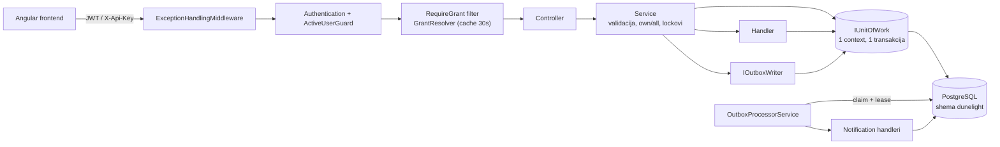
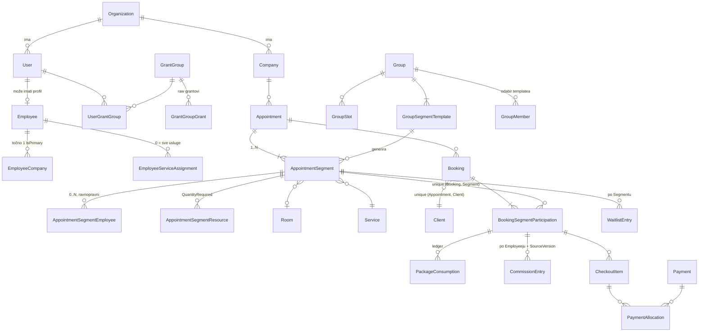

# Arhitektura

> Živi dokument. Ažurira se kad se arhitektura promijeni, ne naknadno "kad stignem".
> Zadnje ažuriranje: 2026-10-08 (K1 dorade iz povratnih informacija klijenta, ADR-0031; prije toga P2 Memberships: faze 2A–2F — katalog planova, članstva, periodi/zaduženja/obnova, pokriće članarinom, cjenovna pogodnost, provizije (Vagaro model), ADR-0025 – ADR-0030; prije toga P1 ADR-0015 – ADR-0018)

Izvori ovog dokumenta, redom prednosti: **stvarni kod** → ADR-ovi u `docs/decisions/` i zapisi faza (`docs/p1/`) → povijesni izvori izvan repozitorija
(sažetak dosadašnjeg arhitekta, Decision Log v1, Target Architecture v1, Business Rules vodič starog
sustava). Gdje se izvori razilaze s kodom, to je zapisano u §7, a ne riješeno pretpostavkom.

## 1. Pregled

DuneLight je backend (ASP.NET Core Web API) za vođenje manjeg fitness/wellness obrta s više poslovnica — zamjena za
Excel tablice. **Organization** je tenant (studio/obrt); pod njom su **Company** (poslovnice/lokacije). Glavni korisnici su
zaposlenici studija (administracija, recepcija, treneri) kroz zasebnu Angular aplikaciju, te platformski operateri kroz
zaseban Management API.

Glavni tokovi:
- **Raspored**: individualni termini (Appointment s jednim ili više Segmenata i klijenata), ponavljajući termini, grupe
  (Group → generirani termini), lista čekanja, pauze zaposlenika, slobodni termini.
- **Lifecycle sudjelovanja**: potvrda, završetak, otkazivanje (Participation / Booking / Appointment razina), no-show,
  korekcije, Group attendance i close-out.
- **Komercijala**: razrješavanje cijene, ručna cijena, paketi klijenata i potrošnja, checkout/plaćanja s alokacijama,
  provizije zaposlenika, proizvodi i skladište.
- **Workforce**: zaposlenici, poslovnice, dodjela usluga, radno vrijeme (predlošci), roster/odsutnosti, fond godišnjeg.
- **Administracija**: registracija organizacije, onboarding, grantovi i grant grupe, branding, postavke, notifikacije, dashboard.

Projekt je u fazi **inkrementalne modernizacije** (ADR-0002): završene su faze S1–S3, Timezone foundation, C, D1–D3B3,
M0–M1H i **P1 — Cancellation / Late Cancellation / NoShow Policy Engine** (2026-10-06, [P1 record](p1/P1_DECISION_RECORD.md)).
**P2 Memberships** je ZAKLJUČEN 2026-10-08 ([P2 record](p2/P2_DECISION_RECORD.md), [plan](p2/P2_PLAN.md), [završni pregled](p2/P2_ZAVRSNI_PREGLED.md)): dizajn zatvoren 2026-10-07,
faze 2A–2F implementirane (katalog planova, članstva, periodi i obnova, pokriće, cjenovna pogodnost, provizije); slijedi ručno testiranje.
**K1** (dorade iz validacije vodiča s klijentom, [K1 record](k1/K1_DECISION_RECORD.md), [povratne informacije](klijent/POVRATNE_INFORMACIJE_v1.md), ADR-0031)
implementiran i ZAKLJUČEN 2026-10-08. Prijedlog daljnjeg redoslijeda iz povratnih informacija: K2 Ovlasti → K3 Veze klijenata (prije P4) → … Sljedeća faza samo na nalog: P3 Client Credit Ledger → P4 Notifications → P5 Group occurrence propagacija →
P6 Workforce/catalog integritet.

## 2. Glavne komponente

### API (`BlueDragon.DuneLight.API`)
- **Odgovornost:** HTTP granica. Tanki kontroleri po modulu (`Controllers/<Modul>/`), autentikacija (JWT `Bearer`,
  `ApiKey` shema preko `X-Api-Key`, zasebna `PlatformBearer` shema za Management), grant autorizacija
  (`Authorization/RequireGrantAttribute`, `RequireGrantOrAssignedCompanyAttribute`, `GrantAuthorization`),
  `Middleware/ExceptionHandlingMiddleware` (iznimke → `{ error: { code, message, details } }`), Swagger, `Startup.cs` (DI).
  Razvojni alati: kontroleri s `[DevelopmentOnly]` (`Development/`) se izvan Development okruženja ne registriraju (ruta fizički ne
  postoji, 404); trenutno `POST /api/dev/time/membership-renewal-run` (prolaz obnove članarina za zadani datum, za ručno testiranje).
- **Lokacija:** `BlueDragon.DuneLight.API/`
- **Ovisi o:** Core (interfejsi, DTO), Infrastructure (registracija implementacija)
- **Koriste je:** Angular frontend, platformski Management klijent

### Core (`BlueDragon.DuneLight.Core`)
- **Odgovornost:** ugovori bez ovisnosti o bazi: DTO-ovi, enumi, servisni interfejsi, outbox događaji (`Events/`),
  `Shared/Grants.cs` (katalog raw grantova: ključ, naziv, modul, opis), `Shared/CapabilityCatalog.cs` (capabilityji kao
  editorska projekcija nad grantovima), `Shared/SystemGrantGroups.cs`, `Shared/ErrorCodes.cs` i `WarningCodes.cs` (jedini
  izvor istine za kodove), iznimke (`Shared/Exceptions`), `PagedRequest/PagedResult`, `OrganizationTimeZones`.
- **Lokacija:** `BlueDragon.DuneLight.Core/`
- **Ovisi o:** ništa unutar rješenja
- **Koriste je:** API, Infrastructure, testovi

### Infrastructure — domena i persistencija
- **Odgovornost:** EF entiteti (`Domain/Models/<Modul>/`), `Domain/Contexts/DatabaseContext.cs` (mapiranje postojeće
  sheme `dunelight`, bez EF migracija), postavke (`Domain/Settings`).
- **Handlers** (`Handlers/Interfaces|Implementations`): čisti pristup bazi po entitetu. Metode ili otvaraju vlastiti context,
  ili rade nad `IUnitOfWork.Context` kad su dio veće operacije.
- **UnitOfWork** (`UnitOfWork/`): jedan `DatabaseContext` + jedna transakcija za poslovnu operaciju preko više handlera;
  `CommitAsync`, inače rollback na dispose.
- **Lokacija:** `BlueDragon.DuneLight.Infrastructure/Domain`, `/Handlers`, `/UnitOfWork`
- **Ovisi o:** Core, EF Core/Npgsql
- **Koriste je:** Services

### Infrastructure — servisi (poslovna logika)
- **Odgovornost:** validacije, autorizacija na razini resursa (own/all), lockovi, mapiranje u DTO. Ključni servisi:
  - Raspored: `AppointmentService` (+ `.Segments.cs`), `BookingService`, `GroupService`, `GroupAttendanceService`,
    `WaitlistService`, `ScheduleBreakService`, `ServiceAvailabilityService`, `OrganizationCalendarService`.
  - Lifecycle i ledgeri: `IParticipationLifecycleService`, `IPaymentLedgerService`, `IPackageConsumptionLedgerService`,
    `ICommissionLedgerService`, `IStockLedgerService`, `IWaitlistPromotionService`.
  - Politika otkazivanja (P1): `CancellationPolicyService` (upravljanje profilima/verzijama/dodjelama + JEDINI resolver
    `ICancellationPolicyResolver`: Company+Service → Service → Company → zadana politika organizacije, najnovija verzija),
    `ParticipationPolicyService` (`IParticipationPolicyService`: klasifikacija klijentskog otkazivanja, ledger posljedica,
    paketna kazna, reverzija i otpis — unutar lifecycle transakcije). Jezgra prijelaza (`BookingService`) je jedna
    tranzicijska matrica za Individual i Group (reverzija efekata prethodnog stanja → brisanje metapodataka → StatusVersion
    + 1 → novi događaj); appointment-wide kaskada ide kroz `ApplyCascadeTransitionInTransaction`.
  - Komercijala: `PricingService` + `PriceResolutionService` (čisti algoritam), `CheckoutService`, `PaymentService`,
    `ClientPackageService`, `PackageService`, `CommissionService`, `ProductService`, `StockService`.
  - Članarine (P2, u tijeku): `MembershipPlanService` (katalog planova: profil + nepromjenjive verzije uvjeta, ADR-0025;
    pravila u `Utils/MembershipPlanRules`; objava verzije uz `applyTo` i klasifikaciju `MembershipPlanChangeClassifier`),
    `ClientMembershipService` (prodaja, otkaz, pauza, promjena plana, raniji izlazak, poništavanje; ADR-0026). Čista pravila:
    `MembershipPeriodCalendar` (jedino mjesto granica perioda), `MembershipLifecycleRules`, `MembershipCoverageOverlap`.
    `MembershipRenewalService` (jedina putanja koja otvara periode i zaduženja; ADR-0027) + `MembershipRenewalBackgroundService`
    (hosted service, obnova svih organizacija); plaćenost zaduženja i stanje duga izvodi `Utils/MembershipChargeSettlement`;
    zaduženja se plaćaju kroz checkout (stavka `MembershipCharge`). Pokriće (ADR-0028): `MembershipCoverageService` je jedina
    putanja za claim/storno u ledgeru korištenja i projekciju odluke (strana sudjelovanja: nastanak, prijelaz, promjena
    vremena, brisanje; strana članstva: usklađivanje pod lockom članstva), čista evaluacija u `Utils/MembershipCoverageRules`;
    `GroupMembershipSkipService` vodi članove grupe preskočene zbog duga (Q18) i naknadno dodavanje (Q53). Cjenovna pogodnost
    (ADR-0029): pravila na verziji plana, izbor jedne prilagodbe u čistom `Utils/PriceAdjustmentResolver` (najbolja cijena, Q1),
    automatsku cijenu sudjelovanja postavlja isti servis pokrića (zaštite: ručni iznos, već plaćeno). Provizije (ADR-0030):
    `CommissionService` (ledger, Vagaro model):
    - izbor pravila: pravilo za uslugu ima prednost pred općim pravilom zaposlenika ("Bez provizije" isključuje uslugu), verzija po
      datumu važenja bez povratka na stariju; uz svaku proviziju objašnjenje izbora;
    - osnovica za odrađeno po prekidačima "oduzmi popuste" / "oduzmi popuste članstva";
    - Q38 provizija na plaćenu P1 naknadu (`SyncPolicyFeeCommission`);
    - provizija na prodaju za zaposlenika odabranog na stavci ("Sold By");
    - prva prodaja članarine (`EvaluateMembershipFirstSale`, korisnik samo na članstvu, ishod se pamti);
    - naknadna dodjela korisnika i korekcija (Q50).
    
    Jedini put storna je `Reverse`.
  - Autorizacija: `GrantResolver` (grantovi iz baze, in-memory cache ~30 s), `GrantGroupService`,
    `PermissionAdministrationSafetyService` (invarijanta `permissions.manage`), `GrantGroupCapabilityAuthoringService`
    (capability editor nad `CapabilityCatalog`-om: sprema samo raw grantove, authoring-state izvodi iz njih; ADR-0023),
    `ActiveUserGuard`.
  - Platforma: `Services/Management/*` (PlatformAccount, zaseban JWT, bootstrap pri startu).
- **Utils** (`Infrastructure/Utils/`): čista domenska pravila bez I/O, npr. `AppointmentLifecycle`, `ParticipationHistory`,
  `ParticipationSettlement`, `SchedulingConflictGuard`, `IntervalCapacity`, `GroupCapacityGuard`, `EmployeeServiceEligibility`,
  `SegmentPricingSource`, `PackageValidity`, `CancellationPolicyRules`, `ParticipationEventMetadata`, `PolicyConsequences`, `PolicyOverride`, `ParticipationPackageSelections`, `PackageCounting`, `DbErrors`, `ExecutionContextResolver`, `AppointmentOwnership`.
- **Lokacija:** `BlueDragon.DuneLight.Infrastructure/Services`, `/Utils`
- **Ovisi o:** Handlers, UnitOfWork, Outbox, Core
- **Koriste je:** API kontroleri

### Outbox i notifikacije
- **Odgovornost:** transakcijski outbox. Lifecycle događaji (`booking.cancelled.v1`, `booking.no-show.v1`, waitlist
  promocija) upisuju se u `outbox_messages` u istoj transakciji (`IOutboxWriter`, `Outbox/ParticipationEvents.cs` je jedino
  mjesto za participation događaje). `OutboxProcessorService` (hosted service) ih claima s leaseom, retry/backoff po
  `OutboxSettings`, i poziva `IOutboxMessageHandler` implementacije koje stvaraju interne `Notification` zapise.
  Stvarne SMS/email dostave nema. Uz outbox procesor radi i `MembershipRenewalBackgroundService` (P2: obnova članarina,
  idempotentna; ne piše outbox događaje do P4).
- **Lokacija:** `Infrastructure/Outbox/`, `Core/Events/`
- **Ovisi o:** UnitOfWork, NotificationHandler
- **Koriste je:** BookingService, AppointmentService, GroupService, WaitlistService

### DatabaseMigration
- **Odgovornost:** samostalna konzolna aplikacija s FluentMigrator runnerom; jedini način izgradnje sheme.
  Verzija migracije = `[DeveloperMigration(god, mj, dan, Developer, redni_broj)]` → `yyyyMMddAAAAoo`.
  Početna (baseline) migracija `20261025000000`–`20261025000011` (`Migration_2026_10_25_Baseline00..11_*`, po domenama)
  gradi trenutnu shemu od nule i **ne seeda ništa** (ADR-0022); svaka iduća promjena je nova migracija.
- **Lokacija:** `BlueDragon.DuneLight.DatabaseMigration/` (`Migrations/2026/*`, `Configuration/DatabaseConfiguration.cs`)
- **Ovisi o:** FluentMigrator, Npgsql
- **Koriste je:** developer (ručno pokretanje), testovi (shema mora postojati)

### Testovi
- **Odgovornost:** xUnit integracijski testovi nad stvarnim PostgreSQL-om (bez mockova). `Scheduling/` je
  karakterizacijska suite: `SchedulingTestHost` gradi pravi DI kontejner, `SchedulingWorld` sije zaseban tenant po testu i
  briše ga na kraju. Ponašanje se pokreće kroz servise, stanje čita iz baze. Detalji: `docs/appointment-booking-characterization.md`.
- **Lokacija:** `BlueDragon.DuneLight.UnitTests/`
- **Ovisi o:** Infrastructure, Core, lokalni Postgres

## 3. Tok podataka

Tipična pisaća operacija (npr. otkazivanje Participationa):
1. `RequireGrant` provjerava da korisnik ima barem jedan od navedenih grantova; servis dobiva `hasFullScope`
   (`.all` grant) i za own-scope razrješava `User → Employee` na serveru.
2. Servis otvara `IUnitOfWork`, zaključava subjekte (`FOR UPDATE`, advisory lockovi po subjektu rasporeda, `FOR SHARE`
   na Group redak kod generiranja), provjerava `StatusVersion`, pravila i kapacitete.
3. Promjena statusa ide kroz lifecycle servis: reverzija starih efekata (provizije, potrošnja paketa, check-in plaćanja),
   novi efekti s novim `SourceVersion`, audit zapis, outbox događaj — sve u istoj transakciji, jedan `CommitAsync`.
4. Appointment status se ponovno izvodi iz Participationa.

Vrijeme: instanti su UTC `DateTimeOffset`; lokalni (poslovni) datumi i radno vrijeme računaju se u efektivnoj zoni
Companyja (`Company.TimeZone ?? Organization.TimeZone`) isključivo kroz `OrganizationCalendar` (ADR-0013).

## 4. Model podataka

Sve poslovne tablice nose `organization_id` (tenant). Valuta EUR, iznosi `numeric(10,2)`.

Ključni entiteti (detalji u ADR-0005 – ADR-0012):

| Entitet | Uloga | Ključne invarijante |
|---|---|---|
| `Appointment` | Operativni container u točno jednoj Company. Note, `Form` (Individual/Group occurrence), eksplicitno otkazivanje (`CancelledAt/By`), group close-out (`ClosedOutAt/By`). | Nema Service/Employee/Room/vrijeme/cijenu. `PlannedStart/End` izvedeni iz Segmenata. Status izveden: `Scheduled / Cancelled / Closed`. |
| `AppointmentSegment` | Izvršna jedinica: Service, `PlannedStart/End`, `ActualStart/End?`, Employees[], `PricingMode` + `PricingEmployeeId?`, Room?, Resources[]. | `PlannedEnd > PlannedStart`. Segmenti mogu biti uzastopni, paralelni ili s prazninom. |
| `Booking` | Jedan Client u jednom Appointmentu. | Unique (Appointment, Client). Nema status ni cijenu; summary (`BookingStatusSummary`, uklj. `Mixed`) je izveden. |
| `BookingSegmentParticipation` | Najmanja izvršna i komercijalna jedinica. | Unique (Booking, Segment). Vlasnik statusa (`Confirmed/Completed/Cancelled/NoShow`), `StatusVersion`, cijene i snapshota, settlementa, paketa. P1: strukturirani metapodaci otkazivanja (initiator Client/Business/System, CancelledAt/By, razlog, klasifikacija + snapshot politike samo za Client) i izostanka (NoShowAt/By/Reason) uvijek odgovaraju statusu (DB CHECK). |
| `ParticipationPolicyConsequence` | P1 ledger posljedica politike (kasno otkazivanje / izostanak). | Nepromjenjiv snapshot pravila i naknade; unique (participation, source_version), najviše jedna Active; `Active → Reversed | Waived`; dug Cancelled/NoShow = naknada aktivne posljedice (0 uz potrošenu jedinicu paketa). |
| `CancellationPolicy` / `CancellationPolicyVersion` / `CancellationPolicyAssignment` | P1 imenovani profili, nepromjenjive verzije, dodjele po scopeu. | Točno jedna zadana politika po organizaciji (nastaje pri registraciji); zadana ili dodijeljena se ne deaktivira. |
| `MembershipPlan` / `MembershipPlanVersion` (+ usluge, poslovnice, limiti) | P2 katalog planova članarina (ADR-0025). | Članarina je zasebna domena, nije paket. Uvjeti su u nepromjenjivim verzijama (unique plan + version); aktivni naziv unique; kalendarski način obnove samo uz mjesečni interval; eksplicitni opseg poslovnica (prazno nikad = sve); barem jedna pokrivena usluga; plan se ne briše, samo deaktivira. |
| `ClientMembership` / `MembershipPause` | P2 članstvo klijenta i pauze (ADR-0026). | Uvjeti = nepromjenjiva verzija plana (snapshot); stanje se izvodi, ne sprema; granice perioda računa `MembershipPeriodCalendar`; zakazana promjena uvjeta stupa na prvoj obnovi na ili nakon zakazanog datuma; preklapanje članarina istog klijenta (vrijeme + usluge + poslovnice) zabranjeno; pauze se ne brišu (otkazane ostaju u povijesti). |
| `ClientMembershipPeriod` / `MembershipCharge` | P2 otvoreni periodi i zaduženja (ADR-0027). | Periode i zaduženja perioda otvara samo obnova (idempotentno, unique članstvo + početak); zaduženje ima nepromjenjiv iznos i lifecycle `Open/WrittenOff/Voided`, plaćenost se izvodi iz alokacija (projekcija samo za upite); plaća se kroz checkout stavku `MembershipCharge` (jedno zaduženje u najviše jednom otvorenom checkoutu). |
| `MembershipUsage` / `ParticipationMembershipCoverage` | P2 ledger korištenja članarine i projekcija pokrića sudjelovanja (ADR-0028). | Claim −1 / Release +1 s referencom, nikad brisanje; najviše jedan aktivan claim po sudjelovanju; brojači limita = aktivni claimovi u prozoru/periodu. Projekcija (stanje, razlog, događaj, limit) ima jednog pisca; obje tablice bez FK na sudjelovanje (redoslijed lockova). Pokrivena usluga i pokriće koje čeka evaluaciju imaju dug 0; bez projekcije = ponašanje kao prije P2. |
| `GroupOccurrenceMembershipSkip` | P2 član grupe preskočen zbog duga uz "blokiraj rezervaciju" (Q18). | Unique (segment, klijent); razrješenje nakon plaćanja duga: Added / CapacityFull / Conflict / AlreadyParticipating / NotApplicable. |
| `MembershipPlanPriceBenefit` | P2 pravilo cjenovne pogodnosti verzije plana (ADR-0029). | Izričit opseg AllServices / Service (prazna usluga nikad ne znači "sve"); jedno pravilo po usluzi i jedno AllServices; PercentOff / AmountOff / FixedPrice. Primijenjena prilagodba i evaluacija kandidata su na sudjelovanju (`adjustment_*`). |
| `PackageConsumption` | Ledger potrošnje paketa po Participationu. | `SourceVersion`, reverzija zapisom, nikad brisanjem. P1: okidač `ServiceCompletion | PolicyConsequence` (kazna vezana uz posljedicu). |
| `CommissionRule` / `CommissionRuleTier` | Pravilo provizije (ADR-0010, ADR-0030). | Vrsta Performance (usluga, opće pravilo AllServices) / Sale (proizvod, paket, plan članarine); Percentage / Fixed / None ("Bez provizije", samo usluga); opće pravilo = razine (u P2 jedna bez praga, Payroll dodaje razine po prometu); `effective_from` = verzije, `deactivated_from` = od tada nema pravila (bez povratka); unique (zaposlenik, vrsta, predmet, datum) neovisno o aktivnosti. Nema pravila = nema provizije. |
| `CommissionEntry` | Provizija. | Individual: unique (participation, source_version) po Employeeju; Group: jedna po (Segment, Employee) kod close-outa; P2: PolicyFee po (posljedica, Employee, verzija), MembershipSale po (članstvo, verzija), prodaja po (stavka, verzija). Snapshot izvora pokrića i primijenjenih postavki; storno = Reversed + razlog, izvještaj po događajima. |
| `Checkout` / `CheckoutItem` / `Payment` / `PaymentAllocation` | Naplata. | Settlement = zbroj aktivnih alokacija po Participationu. |
| `Group` / `GroupSlot` / `GroupSegmentTemplate` / `GroupMember` / `WaitlistEntry` | Ponavljajuće grupe. | `membership_version` za optimistično generiranje; waitlist jedinstven po (Segment, Client) za aktivne (Waiting) unose. |
| `User` / `Employee` | Identitet vs. workforce profil. | Odvojeni pojmovi; User može postojati bez Employeeja. `User.IsActive` se provjerava centralno. |
| `GrantGroup` / `GrantGroupGrant` / `UserGrantGroup` | Autorizacija. `GrantGroupGrant` je jedini perzistirani autorizacijski izvor istine. | Barem jedan aktivni User mora zadržati efektivni `permissions.manage`. Inicijalna Admin grupa (`system_key = 'admin'`) pri registraciji dobiva sve grantove kataloga; migracija koja uvodi novi grant dodaje ga i postojećim sistemskim Admin grupama (ADR-0023). |
| `Role` | Poslovna oznaka (npr. "Trener"). | NE utječe na autorizaciju. |
| `PlatformAccount` | Platformski operater. | Strukturno odvojen od tenant `User`/`Organization`. |

Ostali moduli: katalog (`Service`, `ServiceCompany`, `PriceListItem` + povijest, `Package`, `Room`, `Resource`), klijenti
(`Client`, `ClientTag`, `ClientPackage`), roster (`WorkingHoursTemplate`, `RosterEntry`, `RosterType`, `CompanyHoliday`,
`LeaveFund`), proizvodi (`Product`, `ProductStock`, `StockMovement`), audit logovi po modulu, `OrganizationSettings`,
`OutboxMessage`, `Notification`. Detalji po modulu: ADR-ovi i Swagger.

## 5. Vanjske integracije

- **PostgreSQL** — jedina baza; connection string u `appsettings.json` (`DatabaseSettings`), za migracije u
  `DatabaseMigration/Configuration/DatabaseConfiguration.cs`.
- **Nager.Date** (javni API praznika) — `Infrastructure/Integrations/NagerPublicHolidayApiClient.cs`, typed `HttpClient`;
  `CompanyHolidayService` ga koristi kao prvi izvor javnih praznika poslovnice (fallback: `DefaultCompanyHolidays`).
- **Seq** — Serilog sink na `http://localhost:5341` (hardkodirano u `Program.cs`).
- **Autentikacija** — vlastita (JWT izdaje `JwtService`, hash lozinki/PIN-ova `PasswordHasher`); nema vanjskog identity providera.
- **Datoteke** — branding uploadi na lokalni disk (`wwwroot/branding`, `BrandingFileStorage`).
- Nema plaćanja preko trećih strana, SMS/email providera ni fiskalizacije.

## 6. Ključni principi

Pravila koja se ne krše bez nove odluke (ADR):
- Inkrementalna modernizacija postojećeg koda; nikad prepisivanje od nule ni paralelna arhitektura (ADR-0002).
- Razvojna baza je potrošna: čista ciljna shema, bez compatibility stupaca, dual-writea, backfilla (ADR-0003); isto vrijedi
  za produkcijsku bazu do go-livea (ADR-0024).
- Autorizacija isključivo grantovima; bez Owner/Admin bypassa, bez sigurnosti po imenu grupe, ni workforce Roleu (legacy `UserRole` uklonjen, ADR-0019);
  own-scope uvijek `User → Employee` na serveru (ADR-0004).
- Participation je izvor istine za izvršenje i komercijalu; Booking i Appointment nemaju vlastiti status/cijenu (ADR-0005, ADR-0006).
- Povijest se ne briše ni prepisuje: korekcije su reverzibilne kroz kompenzacijske zapise; fizičko brisanje samo za
  "untouched" Participatione (ADR-0007).
- Preklapanje Employeeja i Clienta, Room i Resource kapacitet su TVRDE blokade; Group kapacitet je MEKI (ADR-0008).
- Nikad automatski birati između više Employeeja (cijena) ni implicitno izvoditi Segment/selektor (ADR-0009, ADR-0011).
- Cijena i provizija su odvojene (ADR-0010). Osnovica postotka za odrađeno je cijena sesije (ručni iznos ili cjenik), umanjena
  samo prema postavkama organizacije; trenutak nastanka je Completed; prošlo razdoblje izvještaja se nikad ne mijenja (ADR-0030).
- Paket nije plaćanje; prihod = stvarna plaćanja (ADR-0012).
- UTC instanti, `DateOnly` poslovni datumi, efektivna zona Companyja; nikad host zona (ADR-0013).
- Uske poslovne naredbe; nema generičkog `PUT` agregata ni promjene Companyja na Appointmentu (ADR-0014).
- Višetablične operacije u jednom `IUnitOfWork`-u; lifecycle efekti, audit i outbox u istoj transakciji.
- Neodlučeno poslovno pravilo = STANI i pitaj.

## 7. Poznati tehnički dug i otvorena pitanja

### 7.1 Odlučeno, čeka implementaciju
- [x] Ukloniti legacy `UserRole` / `users.role` i `role` claim ([ADR-0019](decisions/0019-uklanjanje-userrole.md)) —
  implementirano 2026-10-06 (migracija `20261023000000`), zajedno s povlačenjem granta `employees.role.manage`
  (admin predložak v6, migracije `20261023000001`/`20261023000002`).
- [x] Email klijenta i korisničkog računa jedinstven unutar organizacije, trim + case-insensitive ([ADR-0020](decisions/0020-jedinstven-email-klijenta.md)) —
  implementirano 2026-10-06 (migracija `20261024000000`).
- [x] Dopustiti nula aktivnih poslovnica, ukloniti `LAST_ACTIVE_COMPANY` ([ADR-0021](decisions/0021-nula-aktivnih-poslovnica.md)) —
  implementirano 2026-10-06 (bez migracije; onboarding `HasCompany` i dalje znači "postoji aktivna poslovnica").
- [x] Početna migracija bez seeda ([ADR-0022](decisions/0022-pocetna-migracija-bez-seeda.md)) i katalog grantova/capabilityja u
  kodu umjesto capability/template sustava u bazi ([ADR-0023](decisions/0023-katalog-autorizacije-u-kodu.md)) — implementirano
  2026-10-06 ([Baseline reset record](baseline-reset/BASELINE_RESET_DECISION_RECORD.md)).
- [x] P1 Policy engine ([P1 Decision Record](p1/P1_DECISION_RECORD.md), ADR-0015 – ADR-0018) — implementirano 2026-10-06
  (migracije `20261026000000` – `20261026000002`; uklonjen `organization_settings.cancellation_cutoff_minutes` i
  `PUT /api/organization/settings/cancellation-cutoff`; novi `/api/cancellation-policies` i
  `POST /api/participations/{id}/policy-consequence/waive`).

- [x] P2 Memberships ZAKLJUČEN 2026-10-08 ([P2 Decision Record](p2/P2_DECISION_RECORD.md), [plan](p2/P2_PLAN.md), ADR-0025 – ADR-0030) — dizajn
  zatvoren 2026-10-07. Faza 2A (katalog planova, migracije `20261027000000` – `20261027000002`, `/api/membership-plans`),
  faza 2B (članstva i lifecycle, migracije `20261027000003` – `20261027000005`, `/api/clients/{id}/memberships`,
  `/api/memberships/{id}/...`, grantovi `clients.memberships.*` i `catalog.memberships.deactivate`, postavka
  `PUT /api/organization/settings/membership-change-notice`) i faza 2C (periodi, zaduženja, obnova, migracije
  `20261027000006` – `20261027000008`, `/api/memberships/{id}/periods|charges`, `/api/membership-charges/{id}/write-off`,
  `/api/checkouts/{id}/items/membership-charge`, `PUT /api/organization/settings/membership-debt`, grant
  `memberships.charges.write-off`, hosted service obnove) implementirane 2026-10-07; faza 2D (pokriće članarinom, limiti, P1
  `MembershipAction`, dug i blokada, migracije `20261027000009` – `20261027000011`, `PUT /api/organization/settings/membership-coverage`,
  `GET /api/groups/{id}/membership-skips`, grant `appointments.membership-block.override`) i faza 2E (cjenovna pogodnost,
  prilagodbe cijene, migracija `20261027000012`, ADR-0029) i faza 2F (provizije, Vagaro model, migracija `20261027000013`,
  ADR-0030, migracija `20261027000014`, `GET/PUT /api/commissions/settings`, `POST /api/commissions/sale-assignments`,
  `PATCH /api/checkouts/{id}/items/{itemId}/sale-commission-employee`,
  `PATCH /api/memberships/{id}/sale-commission-employee`, `POST /api/commissions/entries/{id}/reassign`) implementirane 2026-10-08.
  Zabilježeno za kasnije: popust za članove na proizvode; uz online booking "odbij kad je limit pun" vrijedi i za rezervacije
  klijenta (Q4 t.3).
- [x] K1 dorade ([K1 record](k1/K1_DECISION_RECORD.md), ADR-0031) — implementirano 2026-10-08 (migracije `20261028000000` –
  `20261028000003`):
  - `PATCH/DELETE api/participations/{id}/arrival` (grant `appointments.arrival.mark`);
  - `api/catalog/cancellation-reasons` (grant `catalog.cancellation-reasons.manage`) i `PUT api/organization/settings/cancellation-reasons`;
  - `POST api/appointments/{id}/restore`;
  - `GET/PUT api/catalog/services/{id}/default-resources`;
  - `GET api/memberships/standing-still`;
  - automatski broj člana;
  - popis preskočenog pri generiranju grupa;
  - upozorenja `PARTICIPATION_NOT_COVERED` / `PARTICIPATION_PACKAGE_AVAILABLE`.

  Za K2: zaseban grant za rad izvan radnog vremena (i kod grupa) i grant korekcije za "vrati termin".
- [ ] Payroll po Vagaro modelu (zasebna faza nakon P2, [plan §26](p2/P2_PLAN.md), [pitanja](payroll/PAYROLL_QUESTIONS.md)): obračunsko
  razdoblje i zatvaranje, tiered po prometu (nadogradnja općeg pravila, bez migracije), klase, trošak usluge, napojnice, satnica
  ili provizija, ovlasti.

### 7.2 Razlike između izvornih dokumenata i koda koje još treba provjeriti
- [ ] **401 bez `{ error }` omotnice (dug L).** Sažetak i `appointment-booking-characterization.md` ga navode kao dug, a
  `ExceptionHandlingMiddleware` (redci ~35–44) već pretvara okvirne 401/403 u standardni oblik. Provjeriti testom i
  zatvoriti ili popraviti.
- [x] **Down migracije.** Zatvoreno početnom migracijom (ADR-0022): stare migracije s Down metodama su obrisane, početna
  migracija nema Down, nove migracije i dalje bez razrađenih Down metoda (ADR-0003).

Riješeno 2026-10-06: redoslijed slojeva je onakav kakav je u kodu (`Controller → Service → Handler`); waitlist
parcijalni unique indeks samo za aktivne unose je namjeran (klijent se smije ponovno upisati nakon promocije/isteka);
P1 record je uveden u `docs/p1/`; README je usklađen s kodom.

### 7.3 Otvorene poslovne odluke (ne izmišljati pravila)
- [ ] Tko i kada smije uređivati `ActualStart/ActualEnd` (stupci postoje; Decision Log #3).
- [x] Prioritet komercijalnih prilagodbi (membership / tag / promo) — odlučeno u P2 (Q1, 2026-10-07): najbolja cijena
  pobjeđuje, jedna prilagodba, bez slaganja; kod iste cijene redoslijed Membership → ClientTag → ClientGroup → Promo; zapis
  primijenjene prilagodbe i izgubljenih kandidata. Implementacija u P2 fazi 2E; sam sustav pogodnosti (tag, promo) je
  zasebna buduća faza. Implementirano u 2E (ADR-0029): članarina je prvi izvor prilagodbe.
- [ ] **Checkout: stavka sesije nakon promjene cijene** (pregled 2E, 2026-10-08). Stavka zadržava iznos zapisan pri dodavanju;
  otvoreni checkout vraća upozorenje `CHECKOUT_ITEM_PRICE_CHANGED` (iznos stavke i trenutni dug sesije) kad se cijena sesije
  promijeni — automatski zbog članarine ili ručno (vrijedi i za P1 ručnu cijenu). Osvježavanje je danas uklanjanje i ponovno
  dodavanje stavke, što nije moguće dok stavka ima aktivnu uplatu. Otvoreno: naredba za osvježavanje stavke (i stavke s uplatom).
- [ ] Djelomična vrijednost paketa i miješano paket + novac (Decision Log #32, dug O).
- [ ] Identitet Group occurrencea samo na razini aplikacije (slot advisory lock), bez DB uniquea (Decision Log #37, dug I).
- [ ] Tko smije zatvoriti Group occurrence u own scopeu (dug B); zarađuje li prazna / sve-NoShow sesija proviziju.
- [ ] Postotna grupna provizija (dug D, `GROUP_COMMISSION_RULE_NOT_SUPPORTED`).
- [ ] Propagacija izmjena templatea na već generirane occurrence ("samo ovaj / ovaj i budući", dug E, faza P5).
- [ ] Politika deaktivacije kataloga (Employee, Room, Resource, Service, Company) s budućim terminima (dug M, faza P6).
- [ ] Premještanje Appointmenta između Companyja — samo ako proizvod zatraži (`MoveAppointmentToCompany`, dug N).
- [ ] Waitlist prioritet po tagovima i auto/manual promocija (Target Arch §12) — kod ima samo FIFO. Odgođeno (P-11) dok ne postoji
  sustav oznaka (što koja oznaka radi: prioritet liste čekanja, pogodnosti…).
- [ ] Vanjska dostava notifikacija (provider, kanali, podsjetnici).
- [ ] **Povrat novca iz zatvorenog checkouta** (refund / kredit klijenta) — nije implementiran; dolazi s P3. Do tada ni
  P2 Q51(a) (povrat + poništavanje prodaje članarine prije početka) nije izvediv, samo regularni otkaz (`docs/p2/P2_PLAN.md` §22).
- [ ] **Platitelj ≠ član** (roditelj plaća djetetu članarinu): stavka zaduženja članarine danas traži istog klijenta kao
  checkout. **Odlučeno (P-14):** model nositelj + podračuni, nositelj plaća termine, pakete i članarine podračuna — faza K3, prije P4.
- [ ] **P4 — obavijesti o članarinama:** P2 ne piše outbox događaje članarina (događaj bez handlera se nikad ne označi
  obrađenim). Handleri u P4 moraju moći raditi **iz stanja u bazi** (periodi, zaduženja, oznake, povijest članstva), jer
  povijesni događaji iz P2 neće postojati (P2 dnevnik 2026-10-07).
- [ ] **Ovlasti: grantovi, grupe i capabilityji** — otvorena tema za kasnije, kad budemo testirali osnovni rad cijele
  aplikacije s frontendom i UX tokom (P2 dnevnik 2026-10-07). Ne implementira se sada.
  - *Princip koji vrijedi odmah (od P2 2B):* grantovi su granularni po poslovnoj RADNJI (ne po polju), posebno za osjetljive
    radnje, da se svaki grant može dati bilo kome; grupe slaže svaki studio sam; nema sistemskih grupa osim Admin ni predložaka
    (ADR-0023 ostaje); novi grantovi se migracijom dodaju samo Admin grupama, ostalima ih studio dodjeljuje kroz editor.
  - *Za kasnije:* (1) capability kao sloj koji grupira grantove u smislene cjeline u editoru; (2) ovisnosti grantova — uz
    uključen grant automatski i grantovi bez kojih frontend za tu radnju ne radi (npr. prodaja članarine traži pregled planova i
    klijenata); (3) predlošci grupa (npr. "Recepcija"), možda, nakon što vidimo koliko je ručnog slaganja u praksi;
    (4) preporučena raspodjela grantova po tipičnim ulogama u dokumentaciji (za članarine: `docs/p2/P2_PLAN.md` §20).
  - *Trenutno stanje (2026-10-07):* `CapabilityCatalog` grupira grantove (View/Manage, Own/All, On); razina Manage uključuje i
    grantove za pregled, što je jedina postojeća "ovisnost". Uloga `CapabilityGrantRole.MandatorySupporting` (prateći grant koji
    se uključuje uz aktivan capability) postoji u modelu i materijalizaciji, ali je nijedan capability ne koristi, a dokumentirana
    je kao "ne za frontend ovisnosti". Ručno dodani grantovi su dopušteni uz capabilityje. Predložaka grupa nema.

### 7.4 Tehnički dug
- [ ] A. `PricingEmployeeId ∈ Segment.Employees` provjerava se samo u servisu, ne relacijski.
- [ ] C. Promjena samo pricing izvora zaključava više nego treba (nizak prioritet).
- [ ] F. Checkout snapshot cijene (opis/iznos stavke) može odstupiti nakon repricinga.
- [ ] H. Provenance otkazivanja kod Group reaktivacije (P1 uvodi initiator; automatska reaktivacija ostaje otvorena).
- [ ] J. Pauze (breaks) imaju stari ±1 dan upit i ne koriste subject-lock model.
- [ ] K. Notifikacije su po Participationu (nema grupiranja po Bookingu/Appointmentu).
- [x] `ArrivedAt/ArrivedBy` — zapisuje ih naredba dolaska (K1-2).
- [ ] Postotna provizija nema zaokruživanje (`CommissionService`).
- [ ] `GrantResolver` cache (~30 s) nema invalidaciju pri promjeni dozvola (svjesni trade-off).
- [ ] Nema apstrakcije vremena (237 poziva `DateTimeOffset.UtcNow`): simulacija sata organizacije za testiranje nije moguća; danas
  postoji samo razvojni prolaz obnove za zadani datum (P2 dnevnik 2026-10-08). Kandidat: `TimeProvider` kroz DI (prihvaćeno kao
  tehnički dug). Potreban je i za ručno testiranje P1 otkaznih prozora (kasni otkaz / izostanak ovise o stvarnom satu), dug grace
  i "budući termin" u pokriću, koje razvojni prolaz obnove ne pomiče.
- [ ] Tajne i bootstrap pristupni podaci platforme su u `appsettings.json` pod verzioniranjem — premjestiti u user-secrets /
  varijable okoline.
- [ ] Seq URL hardkodiran u `Program.cs`.
- [ ] **Sažimanje migracija prije produkcije** (odluka 2026-10-08, P2 dnevnik): migracije P2 (`20261027000000` – `20261027000014`,
  uklj. 13 → 14 koja uklanja ukinute dijelove provizija) se prije go-livea sažimaju u jednu početnu shemu (ADR-0022/ADR-0024);
  dotad se primijenjena migracija ne mijenja.
- [x] Lokalna baza je bila odlutala od koda (migracija `2026-09-26` mijenjana nakon lokalne primjene, pa je
  `20261006000001` padala). Riješeno 2026-10-06: shema `dunelight` u lokalnoj bazi `postgres` obrisana i izgrađena od nule.
- [x] Schema testovi na PostgreSQL 18 (NOT NULL ograničenja u `pg_constraint`) — riješeno 2026-10-06: upiti isključuju
  `contype = 'n'`. Cutover-migracijski testovi (dijeljeni `sqlscript.sql`) obrisani zajedno sa starim migracijama (ADR-0022).
- [ ] Connection string testova je hardkodiran u 13 testnih datoteka (`Database=postgres`); testovi se ne mogu usmjeriti
  na zasebnu bazu bez izmjene koda.
- [ ] Nema lintera/analizatora (automatske provjere stila koda); puni build ima ~259 upozorenja (gotovo sva nullable,
  test projekt). Nije prioritet.
- [x] Ponašanje koje P1 namjerno mijenja (Due ignorira status, cutoff je jedna org postavka, NoShow koristi
  `CancellationReason`, Group un-check-in nulira cijenu, mrtvi `ReturnPackageEntry`...) — riješeno P1 implementacijom;
  karakterizacijski testovi ažurirani (oznaka `CHANGED in P1`).
- [ ] P1 dug (namjerno izvan opsega, vidi P1 record "Debt and future extensions"): allowances, tag iznimke, tierovi,
  EffectiveFrom/grandfathering, automatski waiver kod popunjenog mjesta, djelomični waiver, atomarno "oslobodi slot" kod
  Booking-wide klijentskog otkazivanja zadnjeg klijenta, povrati/Client Credit za surplus (P3). Provizija na naknade: riješeno
  u P2 2F (Q38, postavka organizacije, default Never).

Način rada (odlučeno 2026-10-06): build i testove pokreće Claude; PR-ovi idu na `development-claude`; ovaj repozitorij
pokriva samo backend (Angular frontend se dokumentira u vlastitom repozitoriju); odluke po fazi bilježe se u
`docs/<faza>/` (vidi `docs/WORKFLOW.md`).

## 8. Indeks odluka
| ADR | Naslov | Status |
|-----|--------|--------|
| [0001](decisions/0001-dokumenti-u-repozitoriju.md) | Arhitektonski dokumenti žive u repozitoriju | Prihvaćeno |
| [0002](decisions/0002-inkrementalna-modernizacija.md) | Inkrementalna modernizacija umjesto prepisivanja | Prihvaćeno |
| [0003](decisions/0003-politika-razvojne-baze.md) | Politika razvojne baze: čista shema, bez compatibility slojeva | Prihvaćeno |
| [0004](decisions/0004-autorizacija-grantovima.md) | Autorizacija isključivo preko grantova | Prihvaćeno |
| [0005](decisions/0005-appointment-segment-booking-participation.md) | Appointment → Segment → Booking → Participation model | Prihvaćeno |
| [0006](decisions/0006-lifecycle-i-derivacija-statusa.md) | Lifecycle Participationa i derivacija statusa Appointmenta | Prihvaćeno |
| [0007](decisions/0007-reverzibilne-korekcije-i-povijest.md) | Reverzibilne korekcije i čuvanje povijesti (untouched delete) | Prihvaćeno |
| [0008](decisions/0008-preklapanja-i-kapaciteti.md) | Tvrda pravila preklapanja i kapaciteta; meki Group kapacitet | Prihvaćeno |
| [0009](decisions/0009-cijene-po-participationu.md) | Cijene po Participationu i SegmentPricingMode | Prihvaćeno |
| [0010](decisions/0010-model-provizija.md) | Model provizija (Individual po Participationu, Group po Segmentu) | Prihvaćeno |
| [0011](decisions/0011-group-templatei-i-selektivno-sudjelovanje.md) | Group templatei i selektivno sudjelovanje članova | Prihvaćeno |
| [0012](decisions/0012-settlement-paketi-placanja.md) | Settlement po Participationu; paket ≠ plaćanje; isključivost | Prihvaćeno |
| [0013](decisions/0013-vremenske-zone.md) | Vremenske zone: UTC instanti, DateOnly, efektivna zona Companyja | Prihvaćeno |
| [0014](decisions/0014-uske-poslovne-naredbe.md) | Uske poslovne naredbe umjesto generičkog CRUD-a | Prihvaćeno |
| [0015](decisions/0015-p1-policy-profili-i-resolver.md) | P1: Imenovani verzionirani policy profili i resolver | Prihvaćeno, implementirano |
| [0016](decisions/0016-p1-initiator-i-vremenska-pravila.md) | P1: Initiator otkazivanja, lateness i vremenski guardovi | Prihvaćeno, implementirano |
| [0017](decisions/0017-p1-posljedice-ledger-i-settlement.md) | P1: Ledger posljedica, Due, paketna kazna, surplus, provizija | Prihvaćeno, implementirano |
| [0018](decisions/0018-p1-korekcije-waiver-i-grupe.md) | P1: Korekcijska matrica, waiver i Group pravila | Prihvaćeno, implementirano |
| [0019](decisions/0019-uklanjanje-userrole.md) | Uklanjanje legacy UserRole (users.role) | Prihvaćeno, implementirano |
| [0020](decisions/0020-jedinstven-email-klijenta.md) | Jedinstven email klijenta i korisničkog računa (trim, case-insensitive) | Prihvaćeno, implementirano |
| [0021](decisions/0021-nula-aktivnih-poslovnica.md) | Organizacija smije imati nula aktivnih poslovnica | Prihvaćeno, implementirano |
| [0022](decisions/0022-pocetna-migracija-bez-seeda.md) | Početna (baseline) migracija trenutne sheme, bez seeda | Prihvaćeno, implementirano |
| [0023](decisions/0023-katalog-autorizacije-u-kodu.md) | Katalog grantova i capabilityja u kodu; Admin grupa pri registraciji bez predložaka | Prihvaćeno, implementirano |
| [0024](decisions/0024-produkcijska-baza-do-go-livea.md) | Produkcijska baza je potrošna do go-livea | Prihvaćeno |
| [0025](decisions/0025-p2-clanarine-zasebna-domena-i-katalog-planova.md) | P2: Članarine kao zasebna domena; katalog planova s nepromjenjivim verzijama | Prihvaćeno, 2A implementirano |
| [0026](decisions/0026-p2-clanstvo-lifecycle-i-matematika-perioda.md) | P2: Članstvo — uvjeti kao verzija plana, izvedeno stanje, matematika perioda | Prihvaćeno, 2B implementirano |
| [0027](decisions/0027-p2-periodi-zaduzenja-i-obnova.md) | P2: Periodi, zaduženja i obnova članarine | Prihvaćeno, 2C implementirano |
| [0028](decisions/0028-p2-pokrice-clanarinom.md) | P2: Pokriće sudjelovanja članarinom (ledger, projekcija, limiti, dug) | Prihvaćeno, 2D implementirano |
| [0029](decisions/0029-p2-cjenovna-pogodnost-i-prilagodbe-cijene.md) | P2: Cjenovna pogodnost članarine i opći mehanizam prilagodbi cijene | Prihvaćeno, 2E implementirano |
| [0030](decisions/0030-p2-provizije-vagaro-model.md) | P2: Provizije, Vagaro model (proširuje ADR-0010) | Prihvaćeno, 2F implementirano |
| [0031](decisions/0031-k1-dorade-rasporeda-i-klijenata.md) | K1: dorade rasporeda i klijenata (prošlost, dolazak, razlozi, vraćanje termina, zadani resursi, stajanje članstva) | Prihvaćeno, implementirano |
