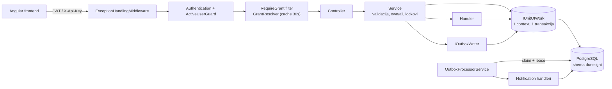
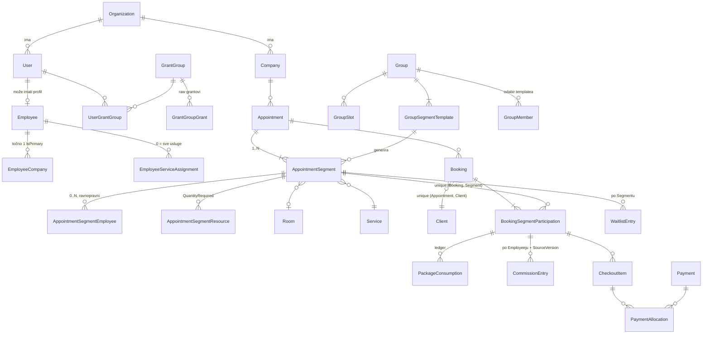

# Arhitektura

> Živi dokument. Ažurira se kad se arhitektura promijeni, ne naknadno "kad stignem".
> Zadnje ažuriranje: 2026-10-06 (odluke nakon početnog popunjavanja: ADR-0019 – ADR-0021, P1 record uveden u `docs/p1/`)

Izvori ovog dokumenta, redom prednosti: **stvarni kod** → ADR-ovi u `docs/decisions/` i zapisi faza (`docs/p1/`) → povijesni izvori izvan repozitorija
(sažetak dosadašnjeg arhitekta, Decision Log v1, Target Architecture v1, Business Rules vodič starog
sustava). Gdje se izvori razilaze s kodom, to je zapisano u §7, a ne riješeno pretpostavkom.

## 1. Pregled

DuneLight je backend (ASP.NET Core Web API) za vođenje manjeg fitness/wellness obrta s više poslovnica — zamjena za
Excel tablice. **Organization** je tenant (studio/obrt); pod njom su **Company** (poslovnice/lokacije). Glavni korisnici su
zaposlenici studija (administracija, recepcija, treneri) kroz zasebnu Angular aplikaciju, te platformski operateri kroz
zaseban Management API.

Glavni tokovi:
- **Raspored**: individualni termini (Appointment s jednim ili više Segmenata i klijenata), ponavljajući termini, grupe
  (Group → generirani termini), lista čekanja, pauze zaposlenika, slobodni termini.
- **Lifecycle sudjelovanja**: potvrda, završetak, otkazivanje (Participation / Booking / Appointment razina), no-show,
  korekcije, Group attendance i close-out.
- **Komercijala**: razrješavanje cijene, ručna cijena, paketi klijenata i potrošnja, checkout/plaćanja s alokacijama,
  provizije zaposlenika, proizvodi i skladište.
- **Workforce**: zaposlenici, poslovnice, dodjela usluga, radno vrijeme (predlošci), roster/odsutnosti, fond godišnjeg.
- **Administracija**: registracija organizacije, onboarding, grantovi i grant grupe, branding, postavke, notifikacije, dashboard.

Projekt je u fazi **inkrementalne modernizacije** (ADR-0002): završene su faze S1–S3, Timezone foundation, C, D1–D3B3,
M0–M1H. Sljedeća je **P1 — Cancellation / Late Cancellation / NoShow Policy Engine** (dizajn zaključan, implementacija nije
započeta), zatim P2 Memberships → P3 Client Credit Ledger → P4 Notifications → P5 Group occurrence propagacija →
P6 Workforce/catalog integritet.

## 2. Glavne komponente

### API (`BlueDragon.DuneLight.API`)
- **Odgovornost:** HTTP granica. Tanki kontroleri po modulu (`Controllers/<Modul>/`), autentikacija (JWT `Bearer`,
  `ApiKey` shema preko `X-Api-Key`, zasebna `PlatformBearer` shema za Management), grant autorizacija
  (`Authorization/RequireGrantAttribute`, `RequireGrantOrAssignedCompanyAttribute`, `GrantAuthorization`),
  `Middleware/ExceptionHandlingMiddleware` (iznimke → `{ error: { code, message, details } }`), Swagger, `Startup.cs` (DI).
- **Lokacija:** `BlueDragon.DuneLight.API/`
- **Ovisi o:** Core (interfejsi, DTO), Infrastructure (registracija implementacija)
- **Koriste je:** Angular frontend, platformski Management klijent

### Core (`BlueDragon.DuneLight.Core`)
- **Odgovornost:** ugovori bez ovisnosti o bazi: DTO-ovi, enumi, servisni interfejsi, outbox događaji (`Events/`),
  `Shared/Grants.cs` (popis raw grantova), `Shared/ErrorCodes.cs` i `WarningCodes.cs` (jedini izvor istine za kodove),
  `DefaultGrantGroups`, iznimke (`Shared/Exceptions`), `PagedRequest/PagedResult`, `OrganizationTimeZones`.
- **Lokacija:** `BlueDragon.DuneLight.Core/`
- **Ovisi o:** ništa unutar rješenja
- **Koriste je:** API, Infrastructure, testovi

### Infrastructure — domena i persistencija
- **Odgovornost:** EF entiteti (`Domain/Models/<Modul>/`), `Domain/Contexts/DatabaseContext.cs` (mapiranje postojeće
  sheme `dunelight`, bez EF migracija), postavke (`Domain/Settings`).
- **Handlers** (`Handlers/Interfaces|Implementations`): čisti pristup bazi po entitetu. Metode ili otvaraju vlastiti context,
  ili rade nad `IUnitOfWork.Context` kad su dio veće operacije.
- **UnitOfWork** (`UnitOfWork/`): jedan `DatabaseContext` + jedna transakcija za poslovnu operaciju preko više handlera;
  `CommitAsync`, inače rollback na dispose.
- **Lokacija:** `BlueDragon.DuneLight.Infrastructure/Domain`, `/Handlers`, `/UnitOfWork`
- **Ovisi o:** Core, EF Core/Npgsql
- **Koriste je:** Services

### Infrastructure — servisi (poslovna logika)
- **Odgovornost:** validacije, autorizacija na razini resursa (own/all), lockovi, mapiranje u DTO. Ključni servisi:
  - Raspored: `AppointmentService` (+ `.Segments.cs`), `BookingService`, `GroupService`, `GroupAttendanceService`,
    `WaitlistService`, `ScheduleBreakService`, `ServiceAvailabilityService`, `OrganizationCalendarService`.
  - Lifecycle i ledgeri: `IParticipationLifecycleService`, `IPaymentLedgerService`, `IPackageConsumptionLedgerService`,
    `ICommissionLedgerService`, `IStockLedgerService`, `IWaitlistPromotionService`.
  - Komercijala: `PricingService` + `PriceResolutionService` (čisti algoritam), `CheckoutService`, `PaymentService`,
    `ClientPackageService`, `PackageService`, `CommissionService`, `ProductService`, `StockService`.
  - Autorizacija: `GrantResolver` (grantovi iz baze, in-memory cache ~30 s), `GrantGroupService`,
    `PermissionAdministrationSafetyService` (invarijanta `permissions.manage`), `Capability*` servisi
    (autorski metapodaci za role-editor, ne runtime autorizacija), `ActiveUserGuard`.
  - Platforma: `Services/Management/*` (PlatformAccount, zaseban JWT, bootstrap pri startu).
- **Utils** (`Infrastructure/Utils/`): čista domenska pravila bez I/O, npr. `AppointmentLifecycle`, `ParticipationHistory`,
  `ParticipationSettlement`, `SchedulingConflictGuard`, `IntervalCapacity`, `GroupCapacityGuard`, `EmployeeServiceEligibility`,
  `SegmentPricingSource`, `PackageValidity`, `BookingCancellationPolicy`, `ExecutionContextResolver`, `AppointmentOwnership`.
- **Lokacija:** `BlueDragon.DuneLight.Infrastructure/Services`, `/Utils`
- **Ovisi o:** Handlers, UnitOfWork, Outbox, Core
- **Koriste je:** API kontroleri

### Outbox i notifikacije
- **Odgovornost:** transakcijski outbox. Lifecycle događaji (`booking.cancelled.v1`, `booking.no-show.v1`, waitlist
  promocija) upisuju se u `outbox_messages` u istoj transakciji (`IOutboxWriter`, `Outbox/ParticipationEvents.cs` je jedino
  mjesto za participation događaje). `OutboxProcessorService` (hosted service) ih claima s leaseom, retry/backoff po
  `OutboxSettings`, i poziva `IOutboxMessageHandler` implementacije koje stvaraju interne `Notification` zapise.
  Stvarne SMS/email dostave nema.
- **Lokacija:** `Infrastructure/Outbox/`, `Core/Events/`
- **Ovisi o:** UnitOfWork, NotificationHandler
- **Koriste je:** BookingService, AppointmentService, GroupService, WaitlistService

### DatabaseMigration
- **Odgovornost:** samostalna konzolna aplikacija s FluentMigrator runnerom; jedini način izgradnje sheme.
  Verzija migracije = `[DeveloperMigration(god, mj, dan, Developer, redni_broj)]` → `yyyyMMddAAAAoo`.
  Stanje na `16b2a59`: 171 migracija, zadnja `20261022000000` (`Migration_2026_10_22_MultiEmployeeSegments`).
- **Lokacija:** `BlueDragon.DuneLight.DatabaseMigration/` (`Migrations/2026/*`, `Configuration/DatabaseConfiguration.cs`)
- **Ovisi o:** FluentMigrator, Npgsql
- **Koriste je:** developer (ručno pokretanje), testovi (shema mora postojati)

### Testovi
- **Odgovornost:** xUnit integracijski testovi nad stvarnim PostgreSQL-om (bez mockova). `Scheduling/` je
  karakterizacijska suite: `SchedulingTestHost` gradi pravi DI kontejner, `SchedulingWorld` sije zaseban tenant po testu i
  briše ga na kraju. Ponašanje se pokreće kroz servise, stanje čita iz baze. Detalji: `docs/appointment-booking-characterization.md`.
- **Lokacija:** `BlueDragon.DuneLight.UnitTests/`
- **Ovisi o:** Infrastructure, Core, lokalni Postgres

## 3. Tok podataka

Tipična pisaća operacija (npr. otkazivanje Participationa):
1. `RequireGrant` provjerava da korisnik ima barem jedan od navedenih grantova; servis dobiva `hasFullScope`
   (`.all` grant) i za own-scope razrješava `User → Employee` na serveru.
2. Servis otvara `IUnitOfWork`, zaključava subjekte (`FOR UPDATE`, advisory lockovi po subjektu rasporeda, `FOR SHARE`
   na Group redak kod generiranja), provjerava `StatusVersion`, pravila i kapacitete.
3. Promjena statusa ide kroz lifecycle servis: reverzija starih efekata (provizije, potrošnja paketa, check-in plaćanja),
   novi efekti s novim `SourceVersion`, audit zapis, outbox događaj — sve u istoj transakciji, jedan `CommitAsync`.
4. Appointment status se ponovno izvodi iz Participationa.

Vrijeme: instanti su UTC `DateTimeOffset`; lokalni (poslovni) datumi i radno vrijeme računaju se u efektivnoj zoni
Companyja (`Company.TimeZone ?? Organization.TimeZone`) isključivo kroz `OrganizationCalendar` (ADR-0013).

## 4. Model podataka

Sve poslovne tablice nose `organization_id` (tenant). Valuta EUR, iznosi `numeric(10,2)`.

Ključni entiteti (detalji u ADR-0005 – ADR-0012):

| Entitet | Uloga | Ključne invarijante |
|---|---|---|
| `Appointment` | Operativni container u točno jednoj Company. Note, `Form` (Individual/Group occurrence), eksplicitno otkazivanje (`CancelledAt/By`), group close-out (`ClosedOutAt/By`). | Nema Service/Employee/Room/vrijeme/cijenu. `PlannedStart/End` izvedeni iz Segmenata. Status izveden: `Scheduled / Cancelled / Closed`. |
| `AppointmentSegment` | Izvršna jedinica: Service, `PlannedStart/End`, `ActualStart/End?`, Employees[], `PricingMode` + `PricingEmployeeId?`, Room?, Resources[]. | `PlannedEnd > PlannedStart`. Segmenti mogu biti uzastopni, paralelni ili s prazninom. |
| `Booking` | Jedan Client u jednom Appointmentu. | Unique (Appointment, Client). Nema status ni cijenu; summary (`BookingStatusSummary`, uklj. `Mixed`) je izveden. |
| `BookingSegmentParticipation` | Najmanja izvršna i komercijalna jedinica. | Unique (Booking, Segment). Vlasnik statusa (`Confirmed/Completed/Cancelled/NoShow`), `StatusVersion`, cijene i snapshota, settlementa, paketa. |
| `PackageConsumption` | Ledger potrošnje paketa po Participationu. | `SourceVersion`, reverzija zapisom, nikad brisanjem. |
| `CommissionEntry` | Provizija. | Individual: unique (participation, source_version) po Employeeju; Group: jedna po (Segment, Employee) kod close-outa. |
| `Checkout` / `CheckoutItem` / `Payment` / `PaymentAllocation` | Naplata. | Settlement = zbroj aktivnih alokacija po Participationu. |
| `Group` / `GroupSlot` / `GroupSegmentTemplate` / `GroupMember` / `WaitlistEntry` | Ponavljajuće grupe. | `membership_version` za optimistično generiranje; waitlist jedinstven po (Segment, Client) za aktivne (Waiting) unose. |
| `User` / `Employee` | Identitet vs. workforce profil. | Odvojeni pojmovi; User može postojati bez Employeeja. `User.IsActive` se provjerava centralno. |
| `GrantGroup` / `GrantGroupGrant` / `UserGrantGroup` | Autorizacija. | Barem jedan aktivni User mora zadržati efektivni `permissions.manage`. |
| `Role` | Poslovna oznaka (npr. "Trener"). | NE utječe na autorizaciju. |
| `CapabilityDefinition` / `DefaultRoleTemplate` / `GrantGroupCapabilitySnapshot` | Verzionirani autorski metapodaci za role-editor i default grant grupe. | Nikad se ne koriste za runtime autorizaciju. |
| `PlatformAccount` | Platformski operater. | Strukturno odvojen od tenant `User`/`Organization`. |

Ostali moduli: katalog (`Service`, `ServiceCompany`, `PriceListItem` + povijest, `Package`, `Room`, `Resource`), klijenti
(`Client`, `ClientTag`, `ClientPackage`), roster (`WorkingHoursTemplate`, `RosterEntry`, `RosterType`, `CompanyHoliday`,
`LeaveFund`), proizvodi (`Product`, `ProductStock`, `StockMovement`), audit logovi po modulu, `OrganizationSettings`,
`OutboxMessage`, `Notification`. Detalji po modulu: ADR-ovi i Swagger.

## 5. Vanjske integracije

- **PostgreSQL** — jedina baza; connection string u `appsettings.json` (`DatabaseSettings`), za migracije u
  `DatabaseMigration/Configuration/DatabaseConfiguration.cs`.
- **Nager.Date** (javni API praznika) — `Infrastructure/Integrations/NagerPublicHolidayApiClient.cs`, typed `HttpClient`;
  `CompanyHolidayService` ga koristi kao prvi izvor javnih praznika poslovnice (fallback: `DefaultCompanyHolidays`).
- **Seq** — Serilog sink na `http://localhost:5341` (hardkodirano u `Program.cs`).
- **Autentikacija** — vlastita (JWT izdaje `JwtService`, hash lozinki/PIN-ova `PasswordHasher`); nema vanjskog identity providera.
- **Datoteke** — branding uploadi na lokalni disk (`wwwroot/branding`, `BrandingFileStorage`).
- Nema plaćanja preko trećih strana, SMS/email providera ni fiskalizacije.

## 6. Ključni principi

Pravila koja se ne krše bez nove odluke (ADR):
- Inkrementalna modernizacija postojećeg koda; nikad prepisivanje od nule ni paralelna arhitektura (ADR-0002).
- Razvojna baza je potrošna: čista ciljna shema, bez compatibility stupaca, dual-writea, backfilla (ADR-0003).
- Autorizacija isključivo grantovima; bez Owner/Admin bypassa, bez sigurnosti po imenu grupe, ni workforce Roleu (legacy `UserRole` uklonjen, ADR-0019);
  own-scope uvijek `User → Employee` na serveru (ADR-0004).
- Participation je izvor istine za izvršenje i komercijalu; Booking i Appointment nemaju vlastiti status/cijenu (ADR-0005, ADR-0006).
- Povijest se ne briše ni prepisuje: korekcije su reverzibilne kroz kompenzacijske zapise; fizičko brisanje samo za
  "untouched" Participatione (ADR-0007).
- Preklapanje Employeeja i Clienta, Room i Resource kapacitet su TVRDE blokade; Group kapacitet je MEKI (ADR-0008).
- Nikad automatski birati između više Employeeja (cijena) ni implicitno izvoditi Segment/selektor (ADR-0009, ADR-0011).
- Cijena i provizija su odvojene; osnovica provizije je `FinalPrice`, nikad plaćeni iznos (ADR-0010).
- Paket nije plaćanje; prihod = stvarna plaćanja (ADR-0012).
- UTC instanti, `DateOnly` poslovni datumi, efektivna zona Companyja; nikad host zona (ADR-0013).
- Uske poslovne naredbe; nema generičkog `PUT` agregata ni promjene Companyja na Appointmentu (ADR-0014).
- Višetablične operacije u jednom `IUnitOfWork`-u; lifecycle efekti, audit i outbox u istoj transakciji.
- Neodlučeno poslovno pravilo = STANI i pitaj.

## 7. Poznati tehnički dug i otvorena pitanja

### 7.1 Odlučeno, čeka implementaciju
- [x] Ukloniti legacy `UserRole` / `users.role` i `role` claim ([ADR-0019](decisions/0019-uklanjanje-userrole.md)) —
  implementirano 2026-10-06 (migracija `20261023000000`), zajedno s povlačenjem granta `employees.role.manage`
  (admin predložak v6, migracije `20261023000001`/`20261023000002`).
- [ ] Email klijenta jedinstven unutar organizacije, case-insensitive ([ADR-0020](decisions/0020-jedinstven-email-klijenta.md)).
- [ ] Dopustiti nula aktivnih poslovnica, ukloniti `LAST_ACTIVE_COMPANY` ([ADR-0021](decisions/0021-nula-aktivnih-poslovnica.md)).
- [ ] P1 Policy engine ([P1 Decision Record](p1/P1_DECISION_RECORD.md), ADR-0015 – ADR-0018).

### 7.2 Razlike između izvornih dokumenata i koda koje još treba provjeriti
- [ ] **401 bez `{ error }` omotnice (dug L).** Sažetak i `appointment-booking-characterization.md` ga navode kao dug, a
  `ExceptionHandlingMiddleware` (redci ~35–44) već pretvara okvirne 401/403 u standardni oblik. Provjeriti testom i
  zatvoriti ili popraviti.
- [ ] **Down migracije.** Politika razvojne baze kaže "bez razrađenih Down migracija", a npr.
  `Migration_2026_10_22_MultiEmployeeSegments` ima punu Down migraciju. Postojeće se ne diraju (ADR-0003); vrijedi li
  pravilo za nove migracije (prijedlog: da)?

Riješeno 2026-10-06: redoslijed slojeva je onakav kakav je u kodu (`Controller → Service → Handler`); waitlist
parcijalni unique indeks samo za aktivne unose je namjeran (klijent se smije ponovno upisati nakon promocije/isteka);
P1 record je uveden u `docs/p1/`; README je usklađen s kodom.

### 7.3 Otvorene poslovne odluke (ne izmišljati pravila)
- [ ] Tko i kada smije uređivati `ActualStart/ActualEnd` (stupci postoje; Decision Log #3).
- [ ] Prioritet komercijalnih prilagodbi (membership / tag / promo); jedna najprioritetnija, bez slaganja — redoslijed
  neodlučen (Decision Log #28, dug G). Model popusta ne postoji (`AdjustmentAmount` se nikad ne piše).
- [ ] Djelomična vrijednost paketa i miješano paket + novac (Decision Log #32, dug O).
- [ ] Identitet Group occurrencea samo na razini aplikacije (slot advisory lock), bez DB uniquea (Decision Log #37, dug I).
- [ ] Tko smije zatvoriti Group occurrence u own scopeu (dug B); zarađuje li prazna / sve-NoShow sesija proviziju.
- [ ] Postotna grupna provizija (dug D, `GROUP_COMMISSION_RULE_NOT_SUPPORTED`).
- [ ] Propagacija izmjena templatea na već generirane occurrence ("samo ovaj / ovaj i budući", dug E, faza P5).
- [ ] Politika deaktivacije kataloga (Employee, Room, Resource, Service, Company) s budućim terminima (dug M, faza P6).
- [ ] Premještanje Appointmenta između Companyja — samo ako proizvod zatraži (`MoveAppointmentToCompany`, dug N).
- [ ] Waitlist prioritet po tagovima i auto/manual promocija (Target Arch §12) — kod ima samo FIFO.
- [ ] Vanjska dostava notifikacija (provider, kanali, podsjetnici).

### 7.4 Tehnički dug
- [ ] A. `PricingEmployeeId ∈ Segment.Employees` provjerava se samo u servisu, ne relacijski.
- [ ] C. Promjena samo pricing izvora zaključava više nego treba (nizak prioritet).
- [ ] F. Checkout snapshot cijene (opis/iznos stavke) može odstupiti nakon repricinga.
- [ ] H. Provenance otkazivanja kod Group reaktivacije (P1 uvodi initiator; automatska reaktivacija ostaje otvorena).
- [ ] J. Pauze (breaks) imaju stari ±1 dan upit i ne koriste subject-lock model.
- [ ] K. Notifikacije su po Participationu (nema grupiranja po Bookingu/Appointmentu).
- [ ] `ArrivedAt/ArrivedBy` postoje, ali ih ništa ne zapisuje (check-in nije implementiran).
- [ ] Postotna provizija nema zaokruživanje (`CommissionService`).
- [ ] `GrantResolver` cache (~30 s) nema invalidaciju pri promjeni dozvola (svjesni trade-off).
- [ ] Tajne i bootstrap pristupni podaci platforme su u `appsettings.json` pod verzioniranjem — premjestiti u user-secrets /
  varijable okoline.
- [ ] Seq URL hardkodiran u `Program.cs`.
- [x] Lokalna baza je bila odlutala od koda (migracija `2026-09-26` mijenjana nakon lokalne primjene, pa je
  `20261006000001` padala). Riješeno 2026-10-06: shema `dunelight` u lokalnoj bazi `postgres` obrisana i izgrađena od nule.
- [ ] 6 schema testova (`AppointmentSegmentSchemaTests` ×3, `BookingSegmentParticipationSchemaTests` ×2,
  `PackageConsumptionLedgerTests.Schema_...`) pada na PostgreSQL 18: PG18 NOT NULL ograničenja bilježi u `pg_constraint`
  (`*_not_null`), a testovi očekuju samo PK/FK/CHECK. Okolinski uzrok, ne regresija koda.
- [ ] Cutover-migracijski testovi (`*CutoverMigrationTests`) nasumično padaju u punom suiteu jer paralelne klase pišu isti
  `sqlscript.sql` (IOException); pojedinačno svi prolaze.
- [ ] Connection string testova je hardkodiran u 13 testnih datoteka (`Database=postgres`); testovi se ne mogu usmjeriti
  na zasebnu bazu bez izmjene koda.
- [ ] Nema lintera/analizatora (automatske provjere stila koda); puni build ima ~264 upozorenja (gotovo sva nullable,
  test projekt). Nije prioritet.
- [ ] Ponašanje koje P1 namjerno mijenja (Due ignorira status, cutoff je jedna org postavka, NoShow koristi
  `CancellationReason`, Group un-check-in nulira cijenu, mrtvi `ReturnPackageEntry`...) — vidi ADR-0015 – ADR-0018.

Način rada (odlučeno 2026-10-06): build i testove pokreće Claude; PR-ovi idu na `development-claude`; ovaj repozitorij
pokriva samo backend (Angular frontend se dokumentira u vlastitom repozitoriju); odluke po fazi bilježe se u
`docs/<faza>/` (vidi `docs/WORKFLOW.md`).

## 8. Indeks odluka
| ADR | Naslov | Status |
|-----|--------|--------|
| [0001](decisions/0001-dokumenti-u-repozitoriju.md) | Arhitektonski dokumenti žive u repozitoriju | Prihvaćeno |
| [0002](decisions/0002-inkrementalna-modernizacija.md) | Inkrementalna modernizacija umjesto prepisivanja | Prihvaćeno |
| [0003](decisions/0003-politika-razvojne-baze.md) | Politika razvojne baze: čista shema, bez compatibility slojeva | Prihvaćeno |
| [0004](decisions/0004-autorizacija-grantovima.md) | Autorizacija isključivo preko grantova | Prihvaćeno |
| [0005](decisions/0005-appointment-segment-booking-participation.md) | Appointment → Segment → Booking → Participation model | Prihvaćeno |
| [0006](decisions/0006-lifecycle-i-derivacija-statusa.md) | Lifecycle Participationa i derivacija statusa Appointmenta | Prihvaćeno |
| [0007](decisions/0007-reverzibilne-korekcije-i-povijest.md) | Reverzibilne korekcije i čuvanje povijesti (untouched delete) | Prihvaćeno |
| [0008](decisions/0008-preklapanja-i-kapaciteti.md) | Tvrda pravila preklapanja i kapaciteta; meki Group kapacitet | Prihvaćeno |
| [0009](decisions/0009-cijene-po-participationu.md) | Cijene po Participationu i SegmentPricingMode | Prihvaćeno |
| [0010](decisions/0010-model-provizija.md) | Model provizija (Individual po Participationu, Group po Segmentu) | Prihvaćeno |
| [0011](decisions/0011-group-templatei-i-selektivno-sudjelovanje.md) | Group templatei i selektivno sudjelovanje članova | Prihvaćeno |
| [0012](decisions/0012-settlement-paketi-placanja.md) | Settlement po Participationu; paket ≠ plaćanje; isključivost | Prihvaćeno |
| [0013](decisions/0013-vremenske-zone.md) | Vremenske zone: UTC instanti, DateOnly, efektivna zona Companyja | Prihvaćeno |
| [0014](decisions/0014-uske-poslovne-naredbe.md) | Uske poslovne naredbe umjesto generičkog CRUD-a | Prihvaćeno |
| [0015](decisions/0015-p1-policy-profili-i-resolver.md) | P1: Imenovani verzionirani policy profili i resolver | Prihvaćeno, nije implementirano |
| [0016](decisions/0016-p1-initiator-i-vremenska-pravila.md) | P1: Initiator otkazivanja, lateness i vremenski guardovi | Prihvaćeno, nije implementirano |
| [0017](decisions/0017-p1-posljedice-ledger-i-settlement.md) | P1: Ledger posljedica, Due, paketna kazna, surplus, provizija | Prihvaćeno, nije implementirano |
| [0018](decisions/0018-p1-korekcije-waiver-i-grupe.md) | P1: Korekcijska matrica, waiver i Group pravila | Prihvaćeno, nije implementirano |
| [0019](decisions/0019-uklanjanje-userrole.md) | Uklanjanje legacy UserRole (users.role) | Prihvaćeno, implementirano |
| [0020](decisions/0020-jedinstven-email-klijenta.md) | Email klijenta jedinstven unutar organizacije | Prihvaćeno, nije implementirano |
| [0021](decisions/0021-nula-aktivnih-poslovnica.md) | Organizacija smije imati nula aktivnih poslovnica | Prihvaćeno, nije implementirano |
