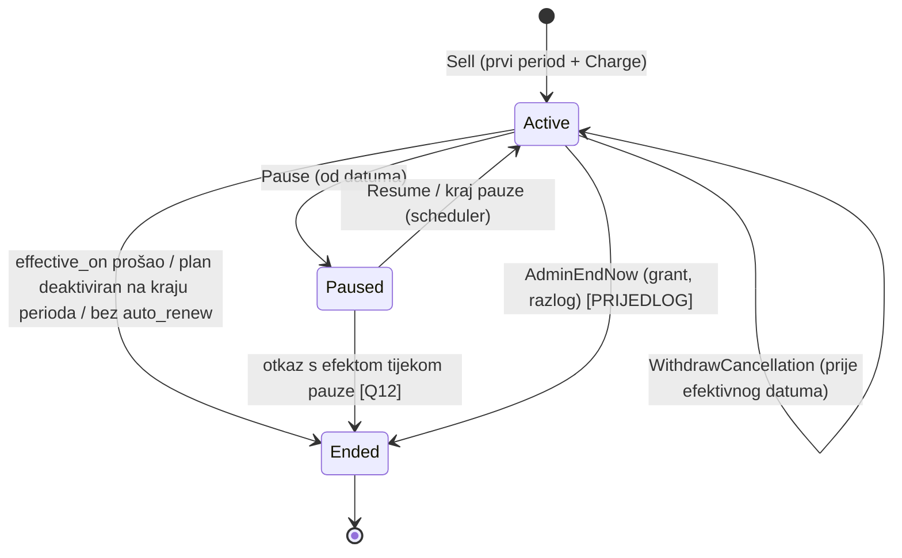

# P2 — Memberships — nalazi iz koda i plan implementacije

> Status: **PRIJEDLOG, ništa nije implementirano** (2026-10-07). Zaključane odluke idu u
> [P2_DECISION_RECORD.md](P2_DECISION_RECORD.md); ovaj dokument je plan i popis pitanja.
> Oznake: **[ODLUČENO]** = iz korisnikovog spec-a, **[PRIJEDLOG]** = moja preporuka koja čeka potvrdu,
> **[PITANJE Qn]** = otvoreno, vidi §8.

---

## 1. Nalazi iz koda

### 1.1 Paketi (najbliži postojeći obrazac)
- `Package` (katalog) → `ClientPackage` (prodana instanca, snapshot strukture) → `ClientPackageServiceEntry` (brojač po usluzi).
  `EntryMode`: `SharedPool` (jedan brojač) / `PerService` (brojač po usluzi); `TotalEntryCount = null` = neograničeno.
  Valjanost je `DateOnly ValidUntilDate`, provjera na **lokalni datum izvođenja** u kalendaru poslovnice (`PackageValidity`).
- Paket je **na razini organizacije** — `GetEligibleForService` ne filtrira po poslovnici.
- Prodaja ide **isključivo kroz checkout**: `CheckoutItemType.Package` → `CheckoutService.Complete` izdaje `ClientPackage`
  (`IssueClientPackage`, idempotentno preko `CheckoutItem.ClientPackageId`). Complete **traži puno plaćanje**
  (`CHECKOUT_OUTSTANDING_BALANCE`).
- Ledger `PackageConsumption`: `Consumed → Reversed` na istom retku (nikad brisanje), najviše jedan aktivan po
  Participationu (parcijalni unique), `Units` 1 ili 0 (neograničen), `ServiceDate`, `Trigger: ServiceCompletion | PolicyConsequence`.
  Jedina pisaća putanja: `IPackageConsumptionLedgerService`; zaključavanje `ClientPackage FOR UPDATE`.
- **Paket se troši tek na `Completed`** (`PackageConsumptionTiming.OnCompletion` — jedina vrijednost). Na rezervaciji se ništa ne
  troši ni rezervira.
- Odabir paketa: Individual = **samo eksplicitni `ClientPackageId`**; Group check-in i P1 kazna = automatski ako je
  **točno jedan** prihvatljiv, inače `PACKAGE_SELECTION_REQUIRED`.
- "Grandfathering" postoji kao obrazac u `ClientService`/`EmployeeService` (nepromijenjena dodjela smije upućivati na
  neaktivan entitet), ne u paketima.

### 1.2 Participation i settlement
- `ParticipationSettlement` (Utils) je **jedina** derivacija: `FinalPrice = Amount`; pokriće paketom **ne mijenja
  FinalPrice** (ostaje retail cijena), nego `MonetaryDue = 0` (`EntitlementCovered`). `SettlementExclusivityPolicy`:
  paket i novac su isključivi po Participationu.
- Provizija (ADR-0010) računa se na `FinalPrice` — dakle i za paketom pokrivene sesije, na retail cijenu.

### 1.3 Pricing
- `PriceResolutionService` = čisti algoritam base cijene (Employee+Company → Employee → Company → org → Default).
- `BookingSegmentParticipation` već ima `BaseAmount/BaseAmountSource → AdjustmentAmount → SuggestedAmount → Amount
  (+ IsAmountManuallyOverridden)`. **`AdjustmentAmount` se nikad ne piše** i nema stupca za izvor prilagodbe.
- **Ne postoje:** cjenovne pogodnosti po tagu (`ClientTag` je samo naziv + boja), "grupe klijenata" kao komercijalni pojam
  (jedine grupe su `Group` = ponavljajući termini), promo kodovi, popusti. Pitanje #28 trenutno je praktično
  **članarina vs ništa** — tag/grupa/promo tek treba izgraditi.

### 1.4 Checkout / plaćanja
- `Checkout` je po **poslovnici** (`company_id`) i klijentu; `CheckoutItem` ima točno jedan tipizirani FK prema `Type`
  (CHECK u bazi); enum komentar već predviđa Membership. `Payment` → `PaymentAllocation` → `CheckoutItem`.
  `PaymentMethod`: Cash, Card, BankTransfer, Other.
- Provizija za prodaju (`GenerateForCheckoutCompletion`) postoji za Product/Package (`CommissionSubjectType`).

### 1.5 Scheduler / pozadinski poslovi
- Postoji samo `OutboxProcessorService` (`BackgroundService`, claim s leaseom, retry/backoff po `OutboxSettings`) i
  `PlatformAccountBootstrapper`. **Nema općeg schedulera** (Quartz/Hangfire nisu u projektu).
- Obrazac claim + lease + idempotentnost iz outboxa je dobar predložak za posao obnove.

### 1.6 Organizacijske postavke
- `OrganizationSettings` (jedan redak po organizaciji) trenutno ima samo `package_consumption_timing`; servis
  `IOrganizationSettingsService` + kontroler postoje → prirodno mjesto za grace/ponašanje kod duga/pravila pauze.

### 1.7 Booking — ulazne točke koje stvaraju Participation
Pokriće/blokada na rezervaciji mora proći kroz **sve**:
`AppointmentService` (kreiranje, `AppointmentFactory`), `AppointmentService.Segments` (dodavanje klijenta segmentu),
`BookingService` (dodavanje klijenta, gost u grupi), `GroupService` (generiranje occurrencea za članove), `WaitlistService`
(promocija). Uz to `SegmentMutator`/promjena vremena segmenta mijenja **datum termina** → mijenja period i prozor limita.

### 1.8 Konvencije koje plan prati
- Grantovi u `Grants.cs` + `CapabilityCatalog.cs`, novi grant = migracija za `system_key = 'admin'` (ADR-0023).
- Kodovi grešaka samo u `ErrorCodes.cs`; uske naredbe (ADR-0014); jedan `IUnitOfWork`; datumi `DateOnly` u kalendaru
  (`OrganizationCalendar`, ADR-0013); migracije `[DeveloperMigration(2026, mj, dan, SilvioHabazin, n)]`, bez seeda.
- Nema membership/subscription/članarina koda (jedino `groups.membership_version` = članstvo u Group, nevezano).

### 1.9 Konflikti spec-a s postojećim kodom/ADR-ovima (traže odluku)
| # | Spec kaže | Kod/ADR danas | Posljedica |
|---|---|---|---|
| K1 | Potrošnja −1, otkaz = storno +1 (implicira potrošnju **na rezervaciji**) | Paket se troši na **Completed** | Membership bi imao drugačiji trenutak potrošnje od paketa → [Q6] |
| K2 | "Pokrivena Participation u settlementu ima iznos 0" | ADR-0012: pokriće **ne mijenja FinalPrice**, samo `MonetaryDue = 0`; provizija na FinalPrice | Ako Amount = 0, trener na članarinskoj sesiji ne dobiva proviziju → [Q9] |
| K3 | "Članarina prva" (automatski) | Individual paket se nikad ne bira automatski | Treba eksplicitno pravilo automatskog pokrića (i kad klijent ima 2 članarine) → [Q10] |
| K4 | Charge ima status "plaćeno" | Plaćenost se svugdje **izvodi** iz alokacija | Predlažem izvođenje → §2.4 |
| K5 | Prodaja/naplata uz dug | Checkout Complete traži puno plaćanje; paket se izdaje tek na Complete | Članarina se ne može izdavati kao paket → §4.4 |
| K6 | Kasno otkazivanje/izostanak | P1 `PackageAction = ConsumeUnit` troši jedinicu **paketa** kao kaznu | Što s kreditom članarine kod kasnog otkaza? → [Q11] |

---

## 2. Domenski model

### 2.1 Entiteti
```
MembershipPlan (katalog, org)
 ├─ MembershipPlanService (pokrivene usluge)
 └─ MembershipPlanUsageLimit (limiti: usluga? × prozor × N)
ClientMembership (instanca, snapshot plana)
 ├─ ClientMembershipServiceEntry / UsageLimit (snapshot pokrića i limita)
 ├─ MembershipPeriod (1..N, jedan po ciklusu)
 │   └─ MembershipCharge (0..1 po periodu; + start fee kao zaseban Charge)
 ├─ MembershipPause (0..N)
 └─ MembershipUsage (ledger, po Participationu)
CheckoutItem.Type = MembershipCharge → PaymentAllocation → Payment
```

**MembershipPlan** (`membership_plans`): `id, organization_id, name, description, price numeric(10,2),
billing_interval (Monthly | Yearly) [+ interval_count, PRIJEDLOG: zadano 1 → omogućuje "3 mjeseca"],
start_fee numeric(10,2) default 0, renewal_anchor (PurchaseDate | FirstOfMonth), max_active_memberships int?,
min_commitment_periods int? [PRIJEDLOG], cancellation_notice_days int? [PRIJEDLOG], pause_allowed bool,
max_pause_days int?, max_pauses_per_year int?, pause_extends_period bool, is_active, sort_order, audit stupci, xmin`.
Pravila pauze su na **planu** (spec: "pravila pauze" na planu), a org postavka daje samo zadane vrijednosti — [Q12].

**MembershipPlanService** (`membership_plan_services`): `plan_id, service_id, period_limit int?` (null = neograničeno u periodu).
Usluga izvan liste = nije pokrivena. (SharedPool analogija: [Q13] — treba li i zajednički limit preko više usluga.)

**MembershipPlanUsageLimit** (`membership_plan_usage_limits`): `plan_id, service_id? (null = cijeli plan),
window (Day | Week | Month | Quarter), max_uses int > 0`; unique (plan, service?, window). Više redaka = kombinacija (AND).

**ClientMembership** (`client_memberships`): `id, organization_id, client_id, plan_id, plan snapshot
(price, interval, renewal_anchor, start_fee, min_commitment_periods, cancellation_notice_days, pause pravila),
lifecycle_status (Active | Paused | Ended)` — izvedeni status vidi §2.3 —
`started_on DateOnly, current_period_id, next_renewal_on DateOnly?, auto_renew bool,
cancellation_requested_at/by, cancellation_effective_on DateOnly?, cancellation_reason,
ended_on DateOnly?, end_reason (Cancelled | PlanDeactivated | DebtTermination? | Admin),
next_plan_id? (promjena plana od sljedećeg ciklusa [ODLUČENO pravilo 6]), xmin`.
Snapshot pokrića/limita: `client_membership_services`, `client_membership_usage_limits` (isti oblik kao plan) —
kao kod paketa, kasnija izmjena plana ne mijenja postojeća članstva do sljedećeg ciklusa [Q14].

**MembershipPeriod** (`membership_periods`): `id, client_membership_id, sequence int, starts_on DateOnly,
ends_on DateOnly (uključivo), is_prorated bool, price numeric(10,2), status (Scheduled | Active | Closed | Voided)`;
unique (membership, sequence) i bez preklapanja (exclusion constraint na daterange ili servisna provjera).
"Krediti perioda" se **ne spremaju kao brojač** — stanje = limit iz snapshota − zbroj ledgera u prozoru [ODLUČENO pravilo 3].

**MembershipCharge** (`membership_charges`): `id, organization_id, client_id, client_membership_id, period_id?,
kind (Period | StartFee), amount numeric(10,2) (snapshot), currency 'EUR', due_on DateOnly,
lifecycle_status (Open | WrittenOff | Voided), written_off_at/by/reason, voided_at/by/reason,
external_reference? (Stripe PaymentIntent kasnije), created_at/by`; unique (period_id, kind) where not Voided.
Plaćeni/neplaćeni iznos se **izvodi** iz `PaymentAllocation` preko `CheckoutItem(Type = MembershipCharge)` — §2.4.

**MembershipPause** (`membership_pauses`): `id, client_membership_id, starts_on, ends_on, reason, created_at/by,
cancelled_at/by` (otkazana pauza ostaje u povijesti).

**MembershipUsage** (`membership_usages`) — ledger pokrića, obrazac kao `PackageConsumption`, ali s **+/− unosima**
kako je odlučeno: `id, organization_id, client_membership_id, period_id, booking_segment_participation_id,
service_id, service_date DateOnly, units int (−1 potrošnja, +1 storno), entry_type (Claim | Release),
reverses_usage_id? (storno referencira potrošnju), reason (Cancellation | NoShowReturn | Reschedule | Correction |
PauseRelease | ...), participation_status_version int, created_at/by`.
Invarijante: najviše jedan **neponišten** Claim po Participationu (parcijalni unique preko `released`-flag ili provjere pod
lockom); Release uvijek referencira Claim; `units` je −1 za Claim i +1 za Release (CHECK). Stanje prozora = Σ units.
Napomena: postojeći `PackageConsumption` koristi "isti redak Consumed → Reversed"; spec traži zaseban storno redak —
to je namjerna razlika, dokumentirati u ADR-u.

**CheckoutItem**: nova vrijednost `CheckoutItemType.MembershipCharge` + nullable FK `membership_charge_id`
(proširenje CHECK constrainta; Quantity = 1).

**OrganizationSettings** (novi stupci): `membership_grace_days int (default npr. 7) [Q15]`,
`membership_debt_behavior (KeepCovering | StopCovering | BlockBooking)`, default **StopCovering** [ODLUČENO: b ili a; Q15],
`membership_limit_exceeded_behavior (FallbackToPaid | Reject)` [Q4], zadane vrijednosti pauze [Q12].

### 2.2 Lifecycle članstva (spremljeni dio)

Ended je završan; ponovni dolazak = nova prodaja (novo `ClientMembership`).

### 2.3 Izvedeni status (ne sprema se) [ODLUČENO]
`MembershipStanding = f(lifecycle_status, danas, periodi, otvoreni Charge-ovi, grace_days)`:
- `Active` → `Current` ako nema Charge s dugom starijim od `due_on + grace_days`; `InGrace` ako je dug unutar grace;
  `Delinquent` ako je grace istekao.
- `PendingCancellation` = Active s postavljenim `cancellation_effective_on`.
- Čista funkcija u `Utils/MembershipStanding.cs` (kao `ParticipationSettlement`), koriste je pokriće, booking guard, read modeli.

### 2.4 Charge — plaćanje izvedeno
`Settled = Σ aktivnih alokacija` (isti kod kao `ParticipationSettlement.SettledAmountOf`), `Outstanding = amount − settled`
(osim WrittenOff/Voided → 0). Izvedeni prikaz: `Pending | PartiallyPaid | Paid | WrittenOff | Voided`.
"Neuspjelo" (failed) je pojam **pokušaja naplate** (Stripe) → kasnije zaseban `MembershipChargeAttempt`, ne status Charge-a
[PRIJEDLOG, Q16]. Fiskalni račun se u HR izdaje na **naplatu**, pa se kasnije veže na Checkout/Payment, a Charge ostaje
"potraživanje" s nepromjenjivim iznosom — model to ne blokira.

---

## 3. Pravila

### 3.1 Pokriće (redoslijed odluke za jedno Participation)
1. Klijent ima `ClientMembership` čiji **period sadrži datum termina** (lokalni datum segmenta u kalendaru poslovnice —
   isti `PackageValidity.ServiceDate`) [ODLUČENO pravilo 2], nije u pauzi na taj datum, usluga je u snapshotu pokrića.
2. Standing na datum odluke: `Delinquent` → po `membership_debt_behavior` (KeepCovering / StopCovering → normalan
   settlement / BlockBooking → `MEMBERSHIP_BOOKING_BLOCKED`).
3. Svi limiti (period_limit + svaki prozor, za uslugu i za plan) imaju preostalo ≥ 1 → Claim −1. Inače [Q4].
4. Prioritet: članarina **prije** paketa [ODLUČENO pravilo 1]. Ako članarina pokrije, paket se ne razmatra; ako ne pokrije
   (limit/dug/usluga), postojeći tok paketa ostaje nepromijenjen.
5. Više članarina koje pokrivaju istu uslugu → [Q10] (prijedlog: zabraniti dvije **aktivne** članarine istog klijenta s
   preklapajućim uslugama ili deterministički redoslijed: najraniji `ends_on`, pa najstariji `started_on`, pa id).
6. Isključivost: pokrivena Participation ne smije imati aktivnu novčanu alokaciju ni paket (proširenje
   `SettlementExclusivityPolicy` na treći izvor).
7. Settlement: `ParticipationSettlement` dobiva `EntitlementCovered = paket ILI aktivni membership Claim` → `MonetaryDue = 0`;
   FinalPrice prema [Q9].

### 3.2 Limiti po prozorima [ODLUČENO, oblik prozora = Q17]
- Prozori: Day / Week / Month / Quarter; **prijedlog: kalendarski** prozori u kalendaru poslovnice termina
  (tjedan pon–ned ISO, mjesec, kvartal), ne klizni i ne relativni na period. Period limit = cijeli `MembershipPeriod`.
- Brojanje: Σ `units` Claim/Release za (membership, [service], datum u prozoru) — uključuje **buduće rezervacije**
  (Claim na rezervaciji, K1/Q6), pa "max 1 dnevno" radi odmah pri bookingu.
- Kombinacija = svi moraju proći (AND). Neograničeno = nema period_limit, prozori i dalje vrijede.
- Konkurentnost: Claim zaključava `client_memberships` redak `FOR UPDATE` (kao `ClientPackage`), lock order: subjekti
  rasporeda → Appointment → Participation → ClientMembership (iza postojećih).

### 3.3 Trenutak potrošnje [Q6 — ključno]
Prijedlog: **Claim na rezervaciji** (kad Participation postane zauzimajuće: Confirmed nastanak/reaktivacija), uz:
- otkaz na vrijeme → Release (+1); kasni otkaz / izostanak → [Q11];
- `Completed` → ništa novo (Claim već postoji); korekcija Completed → Confirmed ne dira Claim;
- promjena vremena segmenta → ako se mijenja datum/period/prozor: Release + novi Claim (u istoj transakciji); ako novi
  Claim ne prolazi → [Q4] ponašanje;
- pauza/otkaz članstva → Claimovi za termine u pauzi / nakon kraja se **ne** releasaju automatski, nego se vraća popis
  pogođenih termina (warning) [Q5].
Alternativa: potrošnja na Completed (kao paket) + "preview" na rezervaciji — jednostavnije, ali limiti nisu tvrdi do
dolaska i online booking ne zna stvarno stanje.

### 3.4 Dug
- Charge nastaje u trenutku otvaranja perioda, `due_on = starts_on` [PRIJEDLOG].
- `KeepCovering`: ništa se ne mijenja, dug se samo prikazuje. `StopCovering`: nakon grace-a novi Claimovi se ne rade
  (rezervacija prolazi, settlement normalan); **postojeći** Claimovi ostaju [PRIJEDLOG]. `BlockBooking`: guard na svim
  ulaznim točkama §1.7 osim generiranja Group occurrencea (automatski proces ne smije pucati — član se generira bez pokrića
  + warning) [Q18].
- Plaćanje duga ne pokriva retroaktivno već odrađene nepokrivene sesije [PRIJEDLOG].

### 3.5 Pauza [Q5/Q12]
Prijedlog: pauza `starts_on..ends_on` unutar pravila plana (max dana, max puta godišnje). Ako `pause_extends_period`:
`ends_on` tekućeg perioda i `next_renewal_on` pomiču se za broj dana pauze (period se "rasteže", Charge ostaje isti);
period koji bi **u cijelosti** pao u pauzu se ne otvara → nema Charge-a. Limiti prozora ne mijenjaju se. Termini u pauzi
nisu pokriveni; postojeći Claimovi za njih se releasaju kod potvrde pauze (sa warningom popisa), da ne ostanu "potrošeni".

### 3.6 Otkaz
- `RequestCancellation(on)` → `cancellation_effective_on = max(kraj tekućeg perioda, kraj minimalne obveze, prvi kraj perioda
  nakon isteka otkaznog roka)` [ODLUČENO pravilo 5 + PRIJEDLOG §3 spec-a]. Bez penala.
- Do efektivnog datuma moguće povlačenje otkaza. Scheduler na efektivni datum ne otvara novi period → `Ended`.
- Neiskorišteni krediti propadaju na kraju perioda [ODLUČENO pravilo 4] — automatski, jer se računa po prozoru/periodu.

### 3.7 Deaktivacija plana [ODLUČENO]
`is_active = false` → nova prodaja `MEMBERSHIP_PLAN_INACTIVE`; scheduler za članstva tog plana ne otvara novi period
(end_reason = PlanDeactivated) — osim ako je zakazana promjena plana (`next_plan_id`) na aktivan plan.

### 3.8 Max aktivnih članarina po planu
Provjera pri prodaji pod `membership_plans FOR UPDATE`: broj članstava s `lifecycle_status IN (Active, Paused)` <
`max_active_memberships` → inače `MEMBERSHIP_PLAN_FULL`. PendingCancellation se još broji [PRIJEDLOG].

---

## 4. Integracije (točna mjesta)

### 4.1 Booking / Participation
- Novi servis `IMembershipCoverageService` (Infrastructure/Services) — **jedina** putanja za Claim/Release, poziva se unutar
  pozivateljevog `IUnitOfWork` (kao `IPackageConsumptionLedgerService`):
  `ClaimOnActivation(uow, participation, execution)`, `ReleaseActive(uow, participation, reason)`,
  `Reevaluate(uow, participation)` (promjena vremena), `Preview(clientId, serviceId, companyId, date)` (read, za UI/online).
- Pozivi: `BookingService` tranzicijska matrica (aktivacija/otkaz/izostanak/korekcija — u `ReversePreviousStateEffects`
  i novom koraku efekata), `BookingFactory` korisnici iz §1.7 (nastanak Confirmed), `SegmentMutator`/promjena vremena u
  `AppointmentService.Segments`, `WaitlistService` promocija, `GroupService` generiranje.
- Čista pravila u `Utils/MembershipCoverageRules.cs` (prozori, limiti, standing) — testabilno bez baze.

### 4.2 Settlement
- `ParticipationSettlement.Of`: `covered = PackageConsumptions.IsSettledByPackage(p) || MembershipUsages.IsCovered(p)`;
  `BookingSegmentParticipation.MembershipUsages` AutoInclude (kao PackageConsumptions).
- `SettlementExclusivityPolicy`: treći izvor; `CheckoutService.AddBookingItem` odbija pokrivenu Participation kao danas paket.
- DTO-ovi participationa: `CoverageType` proširiti s `Membership` + `ClientMembershipId`.

### 4.3 Pricing (faza 5, nakon Q1/Q2)
- `BookingPricing` / `ParticipationPrice.Apply`: nakon base cijene jedan adjustment → upisuje `AdjustmentAmount` + novi
  stupci `adjustment_source_type (Membership | ClientTag | Promo)`, `adjustment_source_id`, `adjustment_rule_snapshot`.
- Novi čisti `PriceAdjustmentResolver` (uz `PriceResolutionService`), ulaz: base cijena + kandidati prilagodbi.
- Mjesto poziva: svi `ResolveServicePrice` + `BookingPricing.AtSuggested(...)` pozivi (iste ulazne točke kao §1.7).

### 4.4 Naplata / checkout
- Prodaja: **zasebna naredba** `POST /api/clients/{clientId}/memberships` (ne kroz Checkout Complete, jer Complete traži puno
  plaćanje, a članstvo smije početi s dugom) — stvara članstvo, prvi period, Charge(Period) i Charge(StartFee) ako > 0.
  [Q19: aktivira li se članstvo odmah ili tek nakon plaćanja prvog Charge-a.]
- Plaćanje: `POST /api/checkouts/{id}/items/membership-charge` (`CheckoutAddMembershipChargeItemRequest { MembershipChargeId }`),
  stavka snapshotta iznos = **outstanding** Charge-a; jedinstveni "lock" kao `LocksParticipation` (Charge ne smije biti u dva
  Open checkouta). Djelomično plaćanje: dopušteno kroz alokacije, ali Checkout Complete i dalje traži da je checkout
  namiren → stavka se dodaje s iznosom koji se plaća [Q20].
- Provizija na prodaju članarine: `CommissionSubjectType.Membership` — **izvan P2** [Q21].

### 4.5 Scheduler obnove
- `MembershipRenewalService : BackgroundService` (Infrastructure/Memberships), interval iz `MembershipRenewalSettings`.
- Svaki tick: za organizacije, "danas" u **org kalendaru** [Q22: org zona ili zona poslovnice prodaje]; odabir članstava
  gdje `next_renewal_on <= danas` (`FOR UPDATE SKIP LOCKED`, batch), po članstvu jedna transakcija:
  zatvori prošli period, otvori novi (ili `Ended`), stvori Charge, primijeni zakazanu promjenu plana, završi pauze.
- Idempotentno: unique (membership, sequence) + unique (period, kind) na Charge-u; catch-up više propuštenih perioda
  (server ugašen) otvara periode redom.
- Isti servis kao `IMembershipRenewalRunner` s ručnim okidačem za testove i admin endpoint
  `POST /api/memberships/renewals/run` [PRIJEDLOG, samo za interni grant].
- Outbox događaji `membership.renewed.v1`, `membership.charge.created.v1`, `membership.ended.v1` (P4 notifikacije, kasnije Stripe
  naplata kao handler) — **pisati već u P2** jer je to šav za Stripe.

---

## 5. API ugovor (prijedlog)

| Metoda | Ruta | Grant | Opis |
|---|---|---|---|
| GET | `/api/membership-plans` (+`/{id}`) | `catalog.memberships.view` | popis/detalj planova |
| POST | `/api/membership-plans` | `catalog.memberships.manage` | novi plan |
| PATCH | `/api/membership-plans/{id}/details` | `.manage` | naziv, opis, sort |
| PUT | `/api/membership-plans/{id}/pricing` | `.manage` | cijena, start fee (vrijedi za nove/sljedeći ciklus) |
| PUT | `/api/membership-plans/{id}/coverage` | `.manage` | usluge + period limiti + prozori (zamjena skupa) |
| PUT | `/api/membership-plans/{id}/rules` | `.manage` | obnova, min obveza, otkazni rok, pauza, max aktivnih |
| POST | `/api/membership-plans/{id}/deactivate` · `/activate` | `.manage` | |
| GET | `/api/clients/{clientId}/memberships` | `clients.memberships.view` | članstva klijenta + standing |
| GET | `/api/memberships/{id}` (+`/periods`, `/usages`, `/charges`) | `clients.memberships.view` | detalji, ledger |
| POST | `/api/clients/{clientId}/memberships` | `clients.memberships.manage` | prodaja (planId, startsOn?) |
| POST | `/api/memberships/{id}/cancellation` · `DELETE` isto | `.manage` | zatraži / povuci otkaz |
| POST | `/api/memberships/{id}/pauses` · `/pauses/{pid}/cancel` | `.manage` | pauza |
| POST | `/api/memberships/{id}/plan-change` | `.manage` | promjena plana od sljedećeg ciklusa |
| POST | `/api/memberships/{id}/end` | `clients.memberships.end` | administrativni prekid odmah (razlog) |
| POST | `/api/membership-charges/{id}/write-off` | `memberships.charges.write-off` | otpis duga (razlog, audit) |
| POST | `/api/checkouts/{id}/items/membership-charge` | `checkout.manage` | plaćanje Charge-a |
| GET | `/api/clients/{clientId}/membership-coverage-preview?serviceId&companyId&date` | `clients.memberships.view` | pokriva li + preostalo |

Novi grantovi: `catalog.memberships.view/.manage`, `clients.memberships.view/.manage/.end`, `memberships.charges.write-off`
(+ CapabilityCatalog, migracija za admin grupe). Error kodovi (u `ErrorCodes.cs`): `MEMBERSHIP_PLAN_INACTIVE`,
`MEMBERSHIP_PLAN_FULL`, `MEMBERSHIP_NOT_ACTIVE`, `MEMBERSHIP_ALREADY_ENDED`, `MEMBERSHIP_CANCELLATION_NOT_ALLOWED`,
`MEMBERSHIP_PAUSE_NOT_ALLOWED`, `MEMBERSHIP_PAUSE_OVERLAP`, `MEMBERSHIP_LIMIT_EXCEEDED` (samo za Reject),
`MEMBERSHIP_BOOKING_BLOCKED`, `MEMBERSHIP_CHARGE_NOT_OPEN`, `MEMBERSHIP_CHARGE_ALREADY_IN_CHECKOUT`,
`MEMBERSHIP_OVERLAPPING_COVERAGE` (ako se odabere zabrana u Q10). Warningi (`WarningCodes`):
`MEMBERSHIP_NOT_COVERED_LIMIT`, `MEMBERSHIP_NOT_COVERED_DEBT`, `MEMBERSHIP_AFFECTED_BOOKINGS`.

---

## 6. Migracije (redom, svaka nova datoteka)
1. `P2MembershipPlans` — `membership_plans`, `membership_plan_services`, `membership_plan_usage_limits`.
2. `P2AdminGrants` — novi grantovi za `system_key = 'admin'`.
3. `P2ClientMemberships` — `client_memberships` + snapshot tablice, `membership_periods`, `membership_pauses`.
4. `P2MembershipCharges` — `membership_charges`; `checkout_items.membership_charge_id` + proširen CHECK i lock indeks.
5. `P2OrganizationMembershipSettings` — stupci u `organization_settings`.
6. `P2MembershipUsages` — ledger + parcijalni unique + CHECK-ovi.
7. (faza 5) `P2ParticipationAdjustmentSource` — `adjustment_source_type/id/snapshot` na participationu + tablica pravila popusta.

---

## 7. Plan po fazama

| Faza | Sadržaj | Složenost | Testovi |
|---|---|---|---|
| **2A** Plan + CRUD | entiteti/migracije 1–2, `MembershipPlanService`, kontroler, grantovi, kodovi | S | validacije (cijena ≥ 0, limiti > 0, duplikati prozora), deaktivacija, grant pokrivenost |
| **2B** Članstvo + lifecycle | prodaja, snapshot, prvi period (oba sidra obnove, proracija po Q3), otkaz/povlačenje, pauza, promjena plana, end, max aktivnih | M | pravila efektivnog datuma otkaza, min obveza, pauza produžuje period, konkurentna prodaja zadnjeg mjesta |
| **2C** Periodi + scheduler + Charge + checkout | `MembershipRenewalService`, Charge, checkout stavka, write-off, izvedeni standing, org postavke, outbox | L | catch-up više perioda, idempotentnost (dupli tick), 1. u mjesecu preko veljače/prijestupne, plaćanje djelomično/puno, write-off, standing kroz grace |
| **2D** Pokriće + ledger + limiti | `IMembershipCoverageService`, Claim/Release na svim ulaznim točkama, settlement, isključivost, prioritet nad paketom, limiti, dug, pauza | **XL** | karakterizacijski testovi lifecyclea (Individual = Group), limiti po prozorima (granice tjedna/mjeseca u zoni), konkurentni Claim zadnjeg kredita, reschedule preko granice perioda, kasni otkaz [Q11], postojeći scheduling suite mora ostati zelen |
| **2F** Provizije (Vagaro model, §13) | `None`, povijest pravila (`effective_from`), nadjačavanje po izvoru plaćanja, org postavke osnovice, snapshot izvora pokrića na proviziji, ADR uz ADR-0010 | M | postojeći iznosi nepromijenjeni uz default postavke, osnovica po izvoru (direktno/paket/neograničen paket/članarina), pravilo važeće na datum sesije, nadjačavanje, grupe nepromijenjene |
| **2E** Cjenovna pogodnost | nakon Q1/Q2: adjustment resolver, izvor prilagodbe na participationu, pravila popusta članova | M–L | single-winner/redoslijed, manual override i dalje final, snapshot izvora |

Svaka faza: build + `dotnet test`, ažuriranje `ARCHITECTURE.md`, ADR-ovi (prijedlog: ADR-0025 Membership domena i
lifecycle, ADR-0026 Pokriće članarinom i ledger, ADR-0027 Charge i naplata, ADR-0028 Prioritet cjenovnih prilagodbi).

---

## 8. Otvorena pitanja (opcije + preporuka)

**Q1 — Prioritet cjenovnih pogodnosti (#28). ✅ ODLUČENO 2026-10-07: (a) najbolja cijena — vidi §10.3.** Danas ne postoji nijedna druga pogodnost (tag/grupa/promo), postoji samo
nepisani `AdjustmentAmount`.
- (a) **Najbolja cijena pobjeđuje** — resolver računa sve primjenjive i bira najnižu; uklapa se u `PriceAdjustmentResolver`
  bez konfiguracije; predvidljivo za klijenta. Minus: nema kontrole studija.
- (b) **Fiksni redoslijed s kombiniranjem** — npr. član → tag → promo, svaki se primjenjuje na prethodni rezultat; traži
  stupac po izvoru ili listu prilagodbi na participationu (više od jednog `AdjustmentAmount`). Kosi se s
  Target Arch "no automatic stacking" (Decision Log #28 kaže single-adjustment) → traži novu odluku.
- (c) **Međusobno isključive, fiksni prioritet** (prva primjenjiva po redoslijedu koji bira organizacija) — jedan
  `AdjustmentAmount` + izvor; konfiguracija `OrganizationSettings.adjustment_priority`.
- **Preporuka: (a)** za P2 (single-adjustment je već dogovoren; "najbolja" je deterministična i ne traži UI za redoslijed),
  s mogućnošću kasnijeg prelaska na (c). Tag/promo pogodnosti same po sebi **nisu u P2** — samo pravilo i članarinski izvor.

**Q2 — Pogodnost na pokrivene usluge? ✅ ODLUČENO: samo nepokrivene (ni članarinom ni paketom pokrivene).** Preporuka: pokrivena Participation ima `MonetaryDue = 0`, pa popust na nju nema
novčani učinak — popust se primjenjuje **samo na nepokrivene** (usluge izvan plana i iznad limita). Ako je FinalPrice
osnovica provizije (Q9), primjena popusta i na pokrivene mijenja proviziju — još jedan razlog za "samo nepokrivene".

**Q3 — Prvi period kod sidra "1. u mjesecu". ✅ ODLUČENO: puna cijena i puni krediti, bez proporcije; §14.2.** (a) proporcionalna cijena do kraja mjeseca, (b) puna cijena za kraći period,
(c) prvi period traje do kraja sljedećeg mjeseca (puna cijena, duži period), (d) prag (do 15. → (a), nakon → (c)).
**Preporuka: (a)** proporcija po danima (`price × preostali_dani / dani_mjeseca`, zaokruženo na 0,01), period limit
proporcionalno zaokružen **naviše**, prozorski limiti nepromijenjeni. Najpravednije i najlakše objasniti na računu.

**Q4 — Limit iskorišten.** (a) normalan settlement (Participation nastaje nepokrivena + warning), (b) odbij rezervaciju,
(c) org postavka. **Preporuka: (a) kao default + postavka (c)** — konzistentno s "ne blokirati" duhom kod duga; online booking
će kasnije vjerojatno htjeti (b).

**Q5 — Pauza: ✅ ODLUČENO (s Q12, Q47), §15.1.** vidi §3.5. Pitanja: produžuje li pauza uvijek ili po planu (spec: konfigurabilno → po planu)? Releasaju li se
Claimovi za termine u pauzi automatski (preporuka: da + warning popis) ili se termini otkazuju (preporuka: **ne**, to radi osoblje)?
Charge tekućeg perioda ostaje pun (preporuka), period koji je cijeli u pauzi nema Charge.

**Q6 — Kada se troši (K1). ✅ ODLUČENO 2026-10-07: na rezervaciji — vidi §10.1–10.2.** Preporuka: **Claim na rezervaciji** (§3.3) — jedini način da su limiti tvrdi i online booking
deterministički. Razlika prema paketima (OnCompletion) se dokumentira; paketi ostaju kako jesu. Trošak: više ulaznih točaka
(§1.7) i re-evaluacija kod promjene vremena.

**Q7 — Ostalo iz koda:**
- **Q9 (K2) FinalPrice pokrivene sesije ✅ ODLUČENO 2026-10-07: (a); provizija §10.4**: (a) ostaje retail cijena, `MonetaryDue = 0` (kao paket; provizija trenera teče
  normalno) — **preporuka**; (b) Amount = 0 (doslovno spec) → trener ne dobiva proviziju po FinalPrice. Spec "iznos 0" čitam
  kao "dug 0".
- **Q10 (K3) Više članarina ✅ ODLUČENO: zabrana preklapanja, §14.3**: zabraniti preklapanje pokrivenih usluga među aktivnim članstvima istog klijenta (preporuka;
  jednostavno i bez tihog izbora) ili deterministički redoslijed. Također: smije li osoblje ručno "isključiti" pokriće članarinom
  na konkretnoj Participationu (npr. klijent želi koristiti paket)? Preporuka: da, eksplicitna naredba `coverage/opt-out` s razlogom.
- **Q11 (K6) Kasni otkaz / izostanak pokrivene sesije — djelomično odlučeno (kredit se ne vraća), ostatak Q26 §10.2**: (a) kredit ostaje potrošen (nema Release) i nema naknade,
  (b) Release + P1 naknada kao za nepokrivenu, (c) nova P1 `MembershipAction = ForfeitCredit` analogno `ConsumeUnit`.
  **Preporuka: (c)** s defaultom ForfeitCredit — koristi postojeći P1 policy (verzije, waiver, korekcije) bez novog sustava.
- **Q12 Pravila pauze ✅ ODLUČENO (na planu), §15.1**: na planu (preporuka) uz org zadane vrijednosti, ili samo na organizaciji?
- **Q13 Zajednički limit preko usluga ✅ ODLUČENO (da), §15.3** (npr. "8 grupnih treninga mjesečno bilo koje vrste"): plan-level limit bez usluge to
  pokriva (`service_id = null`) — potvrditi da je to dovoljno.
- **Q14 Izmjena plana ✅ ODLUČENO (bira se pri izmjeni + Q48), §15.2** (usluge/limiti/cijena): vrijedi za nove prodaje i za postojeća članstva **od sljedećeg perioda**
  (preporuka; snapshot se osvježava pri obnovi) ili samo za nove prodaje (grandfathering kao paket)?
- **Q15 Grace/dug default ✅ ODLUČENO (7 dana, ne pokrivaj + oslobađanje budućih), §15.5**: grace 7 dana, `StopCovering` — potvrdi.
- **Q16 Charge status ✅ ODLUČENO (izvedeno + projekcija), §16.1**: potvrdi izvedenu plaćenost i "Failed" kao budući `ChargeAttempt` (Stripe).
- **Q17 Prozori limita ✅ ODLUČENO (kalendarski), validacija Q49 §15.4**: kalendarski u zoni poslovnice termina (preporuka) vs klizni (zadnjih 7 dana).
- **Q18 BlockBooking i Group generiranje ✅ ODLUČENO (preskoči člana), §18.2**: član u dugu se ipak generira u occurrence (bez pokrića) — potvrdi.
- **Q19 Aktivacija ✅ ODLUČENO (odmah, kanal kasnije), §15.5**: odmah pri prodaji s dugom (preporuka, konzistentno s grace logikom) ili tek po plaćanju prvog Charge-a.
- **Q20 Djelomično plaćanje Charge-a ✅ ODLUČENO (dopušteno)** kroz checkout — dopustiti (preporuka) ili samo cijeli iznos.
- **Q21 Provizija na prodaju članarine ✅ ODLUČENO (Q39/Q42, §14.1)** (Target Arch §18 je predviđa): izvan P2 (preporuka) ili u 2C.
- **Q22 "Danas" za obnovu ✅ ODLUČENO (zona organizacije)**: zona organizacije (preporuka — članstvo je na razini org) vs zona poslovnice prodaje.
- **Q23 Scope članstva ✅ ODLUČENO 2026-10-07: plan bira poslovnice** — vidi §10.5.
- **Q24 Prodaja kroz checkout ✅ ODLUČENO (naredba + checkout), §16.2** (kao paket) vs zasebna naredba (preporuka, K5).

---

## 9. Rizici (Stripe, online booking, fiskalizacija)
- **Stripe**: DuneLight ostaje vlasnik rasporeda; Stripe samo naplaćuje Charge (PaymentIntent off-session). Rizik: ako se
  "plaćeno" sprema kao status, webhookovi bi pisali u dva izvora → zato izvedeno iz alokacija; Stripe uplata = `Payment`
  (`PaymentMethod.Online`/`Stripe` kasnije) bez Checkouta ili sa sistemskim Checkoutom — **Payment danas zahtijeva
  `checkout_id`**, to će trebati odluku kod Stripea. Outbox događaj `membership.charge.created.v1` je šav za naplatu.
- **Online booking**: pokriće mora biti potpuno serverski i bez ručnog odabira → zato Claim na rezervaciji, deterministički izbor
  članarine, `Preview` endpoint. Rizik: ako se odabere potrošnja na Completed (Q6 alternativa), online booking ne može
  garantirati limite.
- **Fiskalizacija**: račun se veže na naplatu (Checkout/Payment), Charge nosi nepromjenjiv iznos i opis perioda. Rizik:
  djelomično plaćanje Charge-a → više računa po Charge-u (u redu). Proracija (Q3) mora biti zaokružena i snapshotana na periodu
  (`MembershipPeriod.price`), nikad preračunata.
- **Promjena vremena termina preko granice perioda** i **pauza nakon rezervacija** — najveći izvor bugova; zahtijeva
  karakterizacijske testove prije 2D.
- **Ulazne točke bookinga (6+)** — propušteni poziv = nepokrivena ili dvostruko pokrivena sesija; centralizirati kroz jedan
  servis i dodati test po ulaznoj točki.
- **Lock order** — novi lock (`client_memberships`) mora ići nakon postojećih (subjekti → Appointment → Participation), inače
  deadlock s P1 tokovima.

---

## 10. Razrada nakon odluka Q1, Q6, Q9, Q23 (2026-10-07)

### 10.1 Claim na rezervaciji i neotvoreni period (Q6.1)
Granice budućih perioda su **determinističke** (sidro obnove + interval + zabilježene pauze), pa se očekivani period može
izračunati bez stvaranja retka. Prijedlog modela:
- `membership_usages.period_id` je **nullable**; uz njega uvijek `period_sequence int` (očekivani redni broj perioda) i
  `service_date`. Claim s `period_id IS NULL` = **pending claim** (period još nije otvoren).
- Limiti se broje po `(client_membership_id, period_sequence)` i po kalendarskim prozorima na `service_date` — isti kod za
  otvorene i neotvorene periode.
- Pri otvaranju perioda scheduler u istoj transakciji pridružuje pending claimove (`period_id` = novi period) i ponovno ih
  provjerava prema stanju članstva:
  - period se **ne otvara** (otkaz s efektom, plan deaktiviran, članstvo završeno) → Release svih pending claimova tog
    perioda s razlogom `PeriodNotOpened` → Participation postaje nepokrivena (normalan settlement), outbox događaj
    `membership.coverage.lost.v1` (P4 obavijest osoblju/klijentu);
  - period se otvara, ali je standing `Delinquent` i ponašanje je `StopCovering` → Release s razlogom `DebtNotCovered`;
  - `KeepCovering` → claimovi ostaju.
- Pri rezervaciji se za datum nakon poznatog `cancellation_effective_on` claim **ne radi** (sesija je odmah nepokrivena +
  warning). Povlačenje otkaza ne pokriva retroaktivno već nepokrivene rezervacije (osoblje može ponoviti pokriće naredbom
  `coverage/apply`).
- Pauza s `pause_extends_period` pomiče granice budućih perioda → pending i otvoreni claimovi nakon početka pauze se
  ponovno raspoređuju (Release + Claim pod istim lockom), a oni koji padaju u pauzu se releasaju.
- Unaprijed se ne pokriva dalje od **N budućih perioda** (prijedlog: tekući + sljedeći), da se ne nakupljaju claimovi za
  periode koji se vjerojatno neće otvoriti — vidi Q27.

### 10.2 Otkazni prozor, kasni otkaz i NoShow (Q6.2)
Odlučeno: otkaz na vrijeme vraća kredit; otkaz unutar prozora i NoShow ne vraćaju.
- **Važno:** P1 već ima otkazni prozor. To je zadana politika organizacije (`CancellationPolicy`), koju dodjele po
  Company/Service mogu nadjačati, a `ICancellationPolicyResolver` je po ADR-0015/0016 **jedini** izvor klasifikacije kasno/na vrijeme.
  Zasebna postavka samo za članarine značila bi dva prozora koji se mogu razići (klijent bi bio "na vrijeme" za naknadu,
  a "kasno" za kredit). **Prijedlog: kredit prati P1 klasifikaciju** (`IsLateCancellation`). Zadana politika organizacije
  JEST postavka organizacije, a dodjela po usluzi/poslovnici radi automatski → **Q25**.
- Kredit se vraća (Release) i kad otkaz pokrene studio ili sustav (`Business`/`System`): to je otkaz koji klijent nije
  uzrokovao, a P1 ga ionako ne klasificira kao kasni. Release se radi i kod P1 waivera, a korekcija Cancelled/NoShow → Confirmed
  ponovno uzima kredit.
- **Q26:** naplaćuje li se uz zadržani kredit i P1 naknada? Prijedlog: **ne**. Zadržani kredit je kazna (analogno P1 D6
  `ConsumeUnit`: jedinica ILI naknada, nikad oboje), pa posljedica dobiva `MembershipCreditForfeited = true` i
  `MonetaryDue = 0`. Kod neograničenog plana nema kredita koji bi propao, pa se primjenjuje P1 naknada (isto kao neograničen
  paket u P1 D6).

### 10.3 Promjena vremena kad u novom periodu nema mjesta (Q6.3)
Opcije: (a) promjena vremena prolazi, a sesija postaje nepokrivena (normalna naplata) + warning
`MEMBERSHIP_NOT_COVERED_LIMIT`; (b) promjena vremena se odbija s `MEMBERSHIP_LIMIT_EXCEEDED`.
**Prijedlog: (a)**, isto kao Q4 (limit iskorišten pri rezervaciji) i iz istog razloga: osoblje se ne blokira, a odluka je
vidljiva. Promjena vremena je naredba nad Segmentom, pa se kod Group/višeklijentnog Segmenta jedan klijent bez limita ne smije
pretvoriti u blokadu cijelog termina. Ponašanje uz Q4 može kasnije postati postavka (online booking → Reject).

### 10.4 Prilagodbe cijene (Q1), opći mehanizam
Sustav pogodnosti (promo kodovi, pogodnosti po tagu, grupe klijenata) još nije isplaniran, ali **sigurno dolazi**. Zato P2 gradi
**opći mehanizam prilagodbi**, a članarina je u njemu prvi i u P2 jedini izvor. Kasniji izvori se samo uključuju, bez
promjene sheme participationa.
- `IPriceAdjustmentSource` (po izvoru: `MembershipAdjustmentSource`, kasnije `ClientTagAdjustmentSource`,
  `PromoCodeAdjustmentSource`...) vraća kandidate `{ Type, SourceId, RuleSnapshot, ResultingPrice }` ili razlog zašto se ne
  primjenjuje.
- Čisti `PriceAdjustmentResolver` (Utils): bira najnižu `ResultingPrice` (≥ 0). Kod iste cijene odlučuje fiksni redoslijed tipova.
  Ručni override i dalje ima zadnju riječ.
- Zapis na `booking_segment_participations` (nova migracija): `adjustment_type`, `adjustment_source_id`,
  `adjustment_rule_snapshot jsonb` i `adjustment_evaluation jsonb` (svi kandidati: tip, izvor, cijena, ishod
  `Applied | LostToBetterPrice | LostOnTie | NotApplicable` + razlog). jsonb je jeftin, ne treba ga indeksirati, a nosi
  sve potrebno za izvještaje, objašnjenje klijentu ("promo kod nije primijenjen jer je popust članarine povoljniji") i kasniji
  fiksni prioritet bez migracije. `AdjustmentAmount` ostaje razlika base → suggested.
- **Prijedlog redoslijeda tipova kod iste cijene:** `Membership → ClientTag → ClientGroup → Promo`. Trajni odnos (ugovor)
  ide ispred povremene pogodnosti, a promo je zadnji jer ga se ne isplati "potrošiti" kad ne donosi ništa (jednokratni ili
  ograničeni kod ostaje klijentu). Enum vrijednosti za buduće tipove postoje od početka, bez implementacije.
- Za kasniji prikaz klijentu: evaluacija je snapshot iz trenutka cijene i nikad se ne računa naknadno. Repricing piše novu
  evaluaciju, a stara ostaje u audit logu.
- Q2 (pogodnost samo na nepokrivene sesije) ostaje otvoren, ali se uklapa: kod pokrivene sesije izvor članarine vraća
  `NotApplicable: CoveredByMembership`.
- Sam sustav pogodnosti (definicije popusta po tagu, promo kodovi, grupe klijenata) je **zasebna buduća faza** i treba vlastito
  planiranje; P2 mu ostavlja samo šav (sučelje izvora + zapis evaluacije).

### 10.5 Provizija na članarinske sesije (Q9 dodatno) — analiza, ne implementirati
Kako je danas (ADR-0010, `CommissionService`):
- **Individual:** postotak se računa od `Participation.Amount` (FinalPrice). Pokriće paketom **ne** smanjuje osnovicu, a fiksno
  pravilo daje fiksni iznos po sesiji. **Isti problem već postoji kod neograničenih paketa.** Uz to se prodaja paketa
  posebno provizionira (`PackageSale`), pa za istu vrijednost zarađuju i prodavač i trener.
- **Group:** fiksno po (Segment, Employee) kod close-outa, neovisno o broju klijenata i pokriću. Članarina na to **ne utječe**.
- Rizik iz tvog primjera (50 € članarine, 20 × 15 € = 300 € osnovice) postoji samo za **Individual postotna** pravila (i,
  manje, za fiksna po sesiji).

Opcije za sesije pokrivene članarinom:

| Opcija | Osnovica | Složenost | Napomena |
|---|---|---|---|
| (a) Retail | FinalPrice (danas) | 0 | Precjenjuje vrijednost kod neograničenih planova |
| (b) Raspodijeljena vrijednost | cijena perioda / broj pokrivenih sesija u periodu | **visoka** | Poznata tek na kraju perioda → provizija se računa naknadno (period close), mijenja identitet i vrijeme nastanka provizije, korekcije nakon zatvaranja perioda |
| (c) Bez provizije | 0 | niska | Nepravedno prema treneru |
| (d) Posebna vrijednost pravila | pravilo provizije ima zasebnu postavku za članarinske sesije: `Retail \| FixedPerSession(iznos) \| None` | srednja | Deterministično u trenutku Completed, bez naknadnog obračuna |

**Prijedlog:** (d) na razini `CommissionRule` (s org zadanom vrijednošću), a (b) ostaje mogućnost za kasnije. Isti prekidač je
smisleno ponuditi i za sesije pokrivene paketom. **Treba novi ADR** (proširuje ADR-0010: osnovica više nije uvijek FinalPrice).
Ne implementira se u P2 dok ne odlučiš → **Q28**.

### 10.6 Scope: plan bira poslovnice (Q23)
- Nova tablica `membership_plan_companies (plan_id, company_id)`, a ista lista se snapshotira na članstvo
  (`client_membership_companies`). ~~Prazno = sve poslovnice~~ → **odlučeno Q29:** eksplicitno polje
  `membership_plans.company_scope (AllCompanies | SelectedCompanies)` (snapshot na članstvu). `SelectedCompanies` traži barem
  jednu poslovnicu (`MEMBERSHIP_PLAN_COMPANIES_REQUIRED`), a `AllCompanies` uključuje i buduće poslovnice. Ako su sve odabrane
  poslovnice deaktivirane, plan dobiva warning i nova prodaja nije moguća (`MEMBERSHIP_PLAN_NO_ACTIVE_COMPANY`), a postojeća
  članstva ostaju po grandfathering pravilu.
- Pokriće se provjerava na `Appointment.CompanyId` termina, a prozori limita se računaju u kalendaru te poslovnice.
- Prodaja: članstvo može prodati bilo koja poslovnica (prijedlog), uz zapisan `sold_company_id` zbog kasnijih izvještaja i
  fiskalizacije (račun izdaje poslovnica naplate). "Danas" za obnovu ostaje u zoni organizacije (Q22).
- Deaktivirana poslovnica na snapshotu ostaje (grandfathered), ali u njoj ionako nema novih termina.

### 10.7 Nova otvorena pitanja
- **Q25:** izvor otkaznog prozora za kredit: P1 klasifikacija (prijedlog) ili zasebna postavka organizacije?
- **Q26:** kod kasnog otkaza / NoShowa pokrivene sesije: samo zadržan kredit (prijedlog) ili i P1 naknada?
- **Q27:** koliko daleko unaprijed se pokriva (tekući + sljedeći period, prijedlog) ili bez ograničenja?
- **Q28:** provizija na članarinske sesije: opcija (d) s novim ADR-om (prijedlog) ili ostaviti retail?
- **Q29:** znači li prazan skup poslovnica na planu "sve, uključujući buduće"?
- **Q4** (limit pun pri rezervaciji ili promjeni vremena): normalna naplata + warning (prijedlog), odbijanje ili postavka?

Q25, Q26, Q27 i Q4 su odlučeni 2026-10-07 → §11. Q28 i Q29 su i dalje otvoreni.

---

## 11. Razrada nakon odluka Q25, Q26, Q27, Q4 (2026-10-07)

### 11.1 Kasni otkaz / NoShow: P1 danas i konzistentnost s paketima (Q25 dodatno)
**Kako P1 danas tretira pakete** (P1 record D4–D6, `ParticipationPolicyService`):
- Paket se troši tek na Completed, pa sesija u trenutku otkaza **nije** pokrivena paketom. Kazna se odlučuje tek tada.
- Verzija politike po događaju (LateCancellation, NoShow) ima `FeeType` i zasebno `PackageAction: None | ConsumeUnit`.
- `ConsumeUnit` + prihvatljiv **brojeni** paket → troši se jedinica (`Trigger = PolicyConsequence`) i `MonetaryDue = 0`. Jedinica
  zamjenjuje naknadu, nikad se ne zbraja s njom.
- `PackageAction = None`, nema brojenog paketa ili postoji novčano namirenje → naplaćuje se naknada. Neograničen paket nikad
  nije izvor kazne → naknada.
- **Ponašanje je dakle konfigurabilno po politici** (verzionirano, dodjele po Company/Service), nije fiksno pravilo.

**Odlučeno za članarinu (Q6/Q26):** kredit s brojenjem propada umjesto naknade; neograničen plan → naknada; mjesto u prozoru
ostaje potrošeno. To je isti oblik kao `ConsumeUnit` ("jedinica ILI naknada"), ali **fiksan**.

Opcije (Q31):
| Opcija | Opis | Konzistentnost s paketima | Trošak |
|---|---|---|---|
| (a) Fiksno pravilo | Kako je odlučeno, bez konfiguracije | Isti oblik, ali paket je konfigurabilan, a članarina nije | najmanji |
| (b) Dimenzija P1 politike | `MembershipAction: ForfeitCredit \| ReturnCreditChargeFee` po događaju u verziji politike, default `ForfeitCredit` | **Potpuna**: verzije, dodjele po usluzi/poslovnici, snapshot na posljedici, waiver i korekcije rade kao za paket | srednji (migracija na `cancellation_policy_versions`, polja na posljedici, API politike) |
| (c) Org postavka | Jedan prekidač na `OrganizationSettings` | Slaba: paket po politici, članarina po organizaciji | mali |

**Preporuka: (b)** s defaultom koji je točno odlučeno ponašanje. Ako želiš minimalni P2, onda (a) uz shemu posljedice koja
već sada snapshotira `MembershipAction`, pa je kasniji prelazak na (b) samo dodavanje polja u politiku.
Na posljedici se u oba slučaja snapshotiraju `ClientMembershipId`, `MembershipUsageId` (zadržani Claim) i
`MembershipCreditForfeited`. Waiver ili reverzija posljedice vraća kredit (Release).

### 11.2 Horizont i naknadna evaluacija (Q27)
- **Horizont = tekući + sljedeći period** (uključujući pending claim u još neotvorenom sljedećem periodu, §10.1).
- Rezervacija iza horizonta dobiva **oznaku čekanja** umjesto Claima: unos u ledgeru `entry_type = Deferred`, `units = 0`,
  `expected_period_sequence`. Ne troši limit.
- Kad scheduler otvori period N, horizont se pomiče na N+1. Za sve `Deferred` oznake perioda N+1, u istoj transakciji,
  **redom po `PlannedStart` segmenta, pa po `Participation.CreatedAt`, pa po id-u**:
  1. pokušaj Claim članarinom (limiti, standing, pauza, poslovnica plana);
  2. ako ne prolazi → oznaka se zatvara s ishodom (`NotCovered: LimitReached | Debt | Paused | OutsidePlanCompanies`), a sesija
     ide na sljedeći izvor (§11.5);
  3. emitira se `membership.coverage.evaluated.v1` po članstvu, sa sažetkom pokrivenih i nepokrivenih.
- Evaluacija se uvijek dogodi **najmanje jedan cijeli period prije termina**, pa je pokriće poznato prije dolaska.
- Zakazan kraj (`cancellation_effective_on`) i datum iza kraja → ni Claim ni Deferred; sesija je odmah nepokrivena + warning
  `MEMBERSHIP_ENDS_BEFORE_SESSION`. Povlačenje otkaza ne pokriva ih retroaktivno (vidi §10.1, ručno `coverage/apply`).
- Pomak termina iza horizonta (ili natrag unutar njega) prolazi istu re-evaluaciju kao promjena vremena (§10.3).

### 11.3 Rezervacija koja čeka: nema duga dok se pokriće ne evaluira (Q27.2)
- Izvedeno stanje pokrića Participationa (`MembershipCoverageState`): `Covered | PendingEvaluation | NotCovered(reason) | None`,
  iz ledgera (aktivni Claim / otvoren Deferred / zatvoren Deferred ili Release).
- `ParticipationSettlement`: dok je `PendingEvaluation`, **`MonetaryDue = 0`** i novi flag `CoveragePending = true`.
  Dashboard, read modeli i dug klijenta ga zato ne broje kao dug.
- Checkout: `AddBookingItem` za Participation s `CoveragePending` → `MEMBERSHIP_COVERAGE_PENDING` (nema predujma za sesiju čije
  pokriće nije poznato). Predujam je moguć nakon evaluacije.
- Settlement se "zatvara" (MonetaryDue postaje konačan) u trenutku evaluacije oznake. Ako se Participation otkaže dok čeka,
  oznaka se zatvara s ishodom `Cancelled`, bez kazne kredita (nije ni bio uzet). P1 naknada za takav otkaz ne postoji, jer je
  termin više od jednog perioda daleko i otkaz nije kasni.
- **Obavijesti** (mehanizam postoji): outbox događaji `membership.coverage.evaluated.v1` i `membership.coverage.lost.v1` →
  novi `IOutboxMessageHandler` → interni `Notification` zapisi za recepciju (danas jedini kanal). Dostava klijentu (email/SMS)
  dolazi s P4 nad istim događajima, bez promjene P2.

### 11.4 Ponavljajuće serije (Q27.4)
U kodu postoje dvije vrste serija; obje stvaraju **sve** buduće Participatione odjednom:
1. **`AppointmentService.CreateRecurring`**: Individual serija (Daily/Weekly do `EndDate`, bez gornje granice duljine), jedna
   transakcija, zajednički `recurrenceGroupId`, warningi već postoje **po occurrenceu** (`AppointmentDto.Warnings`).
2. **`GroupService` generiranje occurrencea**: članovi grupe dobivaju Participatione u generiranim terminima.

Prijedlog ponašanja (isti za obje):
- U istoj transakciji, nakon stvaranja Participationa, `IMembershipCoverageService.ApplyForBatch` obrađuje occurrence **redom
  po vremenu**: unutar horizonta Claim (dok limit dopušta), iza horizonta `Deferred`, a nakon zakazanog kraja ništa.
- Kad limit perioda presuši usred serije, ostatak occurrencea u tom periodu ide na sljedeći izvor + warning na tom occurrenceu.
  Serija se nikad ne prekida (Q4 default). S org postavkom "odbij" odbija se **cijela** serija (`MEMBERSHIP_LIMIT_EXCEEDED` s
  popisom datuma), kao kod `RECURRING_CONFLICT`: djelomično stvorena serija bila bi gora od odbijene.
- Group generiranje nikad ne odbija (automatski proces, isto kao §3.4/Q18), čak ni uz postavku "odbij": occurrence se generira
  nepokriven + warning/obavijest.
- Odgovor serije dobiva sažetak: pokriveno N, čeka evaluaciju M, nepokriveno K (po razlogu).

### 11.5 Fallback lanac i postavka limita (Q4)
- Lanac: **članarina → paket → normalan settlement**. Važno: paketi ostaju na `OnCompletion` (odluka Q6), pa se "paket" u lancu
  pri rezervaciji **ne troši**, nego samo utvrđuje (postoji li prihvatljiv paket) i javlja u warningu. Stvarna potrošnja ide
  postojećim tokom na Completed.
- Warningi: `MEMBERSHIP_LIMIT_FALLBACK_PACKAGE` ("limit članarine iskorišten; prihvatljiv paket {naziv} primijenit će se pri
  dolasku") i `MEMBERSHIP_LIMIT_FALLBACK_PAID` ("limit članarine iskorišten; naplaćuje se normalno"), a u `details` tip limita
  (`PeriodCredits | Day | Week | Month | Quarter`) i članstvo.
- **Q30:** kod Individual termina paket se na Completed primjenjuje samo uz **eksplicitni** `ClientPackageId` (kod Group check-ina
  automatski, ako je jedan). "Pokriveno paketom" iz warninga zato kod Individual termina ovisi o recepciji na završetku.
  Prijedlog: paketi ostaju kakvi jesu (odluka Q6), a warning to jasno kaže. Alternativa je automatski izbor paketa kad je
  članarina bila prvi izbor, ali to mijenja ponašanje paketa.
- **Postavka:** P2 = jedan stupac `organization_settings.membership_limit_exceeded_behavior (FallbackToNextSource | Reject)`.
  Čitanje ide samo kroz `IMembershipLimitBehaviorResolver.Resolve(plan, limitKind, channel)`. Pozivatelji tako već predaju tip
  limita i kanal (`BookingChannel.Staff`; `Online` kasnije), a kasnija nadjačavanja (stupac/tablica po planu, tipu limita i
  kanalu) mijenjaju samo resolver.
- **Prijedlog za tip limita:** u P2 bez razlike, ali dizajn računa na to da će se razlikovati. Prozorski limiti (max 1 dnevno)
  su pravilo protiv zlouporabe, pa je "odbij" prirodan, osobito online. Iscrpljeni krediti perioda su komercijalni slučaj, pa je
  "naplati normalno" prirodan. Zato `limitKind` ulazi u resolver od prvog dana.

### 11.6 Nova otvorena pitanja
- **Q28** (otvoreno od §10.5): provizija na članarinske sesije.
- **Q29** (otvoreno od §10.6): prazan skup poslovnica = sve, uključujući buduće?
- **Q30:** paket kao fallback kod Individual termina ostaje eksplicitan na Completed (prijedlog) ili automatski?
- **Q31:** ponašanje kredita kod kasnog otkaza/NoShowa: fiksno, dimenzija P1 politike (prijedlog) ili org postavka?

Q28 – Q31 su odlučeni 2026-10-07 → §12 i decision record. Q31 = opcija (b) iz §11.1.

---

## 12. Razrada nakon odluka Q28 – Q31 (2026-10-07)

### 12.1 Model provizije: uklapanje u postojeći kod (Q28) — ⚠️ ZAMIJENJENO §13 (Vagaro model)
> Opis današnjeg stanja ispod i dalje vrijedi. Prijedlog s `PercentOfCollected`, Q32 – Q36 i napomena o nazivniku iz Q31.4
> **ne vrijede** (ukinuto 2026-10-07).
**Kako je danas** (`commission_rules`, `CommissionService`):
- Pravilo je uvijek **po zaposleniku**: `employee_id NOT NULL` + subjekt `Service | Product | Package` + `calculation_type
  Percentage | Fixed` + `value`. Unique (employee, subject) za aktivna pravila.
- **Postotak po treneru postoji** (trener × usluga). **Ne postoji** pravilo po usluzi bez trenera ni org default. Zaposlenik bez
  pravila za uslugu ne zarađuje ništa.
- Individual: osnovica je `Participation.Amount` (retail), provizija nastaje na Completed (`SourceVersion`).
  Group: samo `Fixed` po (Segment, Employee); postotak daje `GROUP_COMMISSION_RULE_NOT_SUPPORTED`.
  Prodaja (Product/Package): postotak od `CheckoutItem.Amount` na Checkout Complete.

**Prijedlog uklapanja:**
- `commission_rules.calculation_type` → `method: PercentOfRetail | PercentOfCollected | FixedPerSession | None` (za subjekt
  Service). Migracija: `Percentage → PercentOfRetail`, `Fixed → FixedPerSession`, pa se nijedan iznos ne mijenja. Postojeći
  `commission_entries` već snapshotiraju tip i vrijednost; dodaje se snapshot metode i izvora plaćanja.
- Nadjačavanje po izvoru: `commission_rule_source_overrides (rule_id, payment_source: Direct | Package | Membership, method,
  value)`, unique (rule, source). Razrješavanje: nadjačavanje za izvor ?? pravilo.
- Izvor plaćanja sesije određuje se na Completed iz ledgera: aktivni membership Claim → Membership; aktivna potrošnja paketa →
  Package; inače Direct.
- `PercentOfCollected` mijenja **trenutak nastanka** provizije (ADR-0010 danas: na Completed):
  - Package: `ClientPackage.PaidPrice / TotalEntryCount`, poznato na Completed, pa nastaje odmah.
  - Membership: naplaćeno za period / broj sesija koje nose proviziju. Poznato tek kad se **period zaključa**, pa nastaje
    naknadno, na zaključavanju perioda.
  - Direct: plaćeni iznos poznat je tek nakon naplate, a settlement je neovisan o lifecycleu. Treba pravilo kada se računa → Q34.
- **Treba novi ADR** (zamjena ADR-0010 za Individual osnovicu i trenutak nastanka). Implementacija ide kao **zasebna faza nakon
  2D** (prijedlog 2F), jer `PercentOfCollected` za članarinu ovisi o periodima i ledgeru pokrića → Q33.

**Otvorene točke (Q32 – Q36):**
- **Q32 "Default po usluzi":** danas ne postoji pravilo bez trenera. (a) "Default" = postojeće pravilo trener × usluga, a
  nadjačavanja po izvoru su ispod njega (bez nove razine); (b) nova razina: pravilo po usluzi za sve trenere (`employee_id NULL`)
  kao fallback za trenere bez vlastitog pravila. Prijedlog: **(a)** za ovu fazu, a (b) kao zasebno proširenje.
- **Q33** Je li model provizije dio P2 (faza 2F) ili zasebna faza provizija? Prijedlog: 2F unutar P2, nakon 2D.
- **Q34** `PercentOfCollected` za Direct izvor: provizija nastaje (a) kad je sesija potpuno namirena, (b) pri periodičnom
  obračunu (npr. mjesečno), ili (c) na Completed s naknadnim korekcijama kod svake uplate/voida. Prijedlog: **(b)**, isti
  mehanizam zaključavanja kao kod članarine, pa su sva tri izvora "collected" vremenski konzistentna.
- **Q35** Pravila zaključavanja perioda članarine za `PercentOfCollected`: tvoj odgovor upućuje na ranije definirana pravila koja
  ovdje nemam. Prijedlog: period se zaključava na `ends_on + grace_days`; računaju se uplate do zaključavanja; kasnije uplate i
  otpisi ne mijenjaju obračun, nego ulaze kao korekcijski zapis u sljedeći obračun. Potvrdi ili zalijepi ranija pravila.
- **Q36** `PercentOfCollected` za **neograničen paket** (nema broja jedinica, pa nema nazivnika): (a) cijena / broj iskorištenih
  sesija do isteka (naknadno, kao članarina), (b) fallback na `PercentOfRetail`, (c) nije dopušteno (validacija). Prijedlog: (a),
  isti mehanizam kao članarina.
- Napomena: Q31.4 uvodi proviziju i na sesiji kasnog otkaza/NoShowa (ForfeitCredit ili naplaćena naknada). P1 je "proviziju na
  naknade" ostavio kao dug ("Debt and future extensions"), pa novi ADR mora izričito zatvoriti tu točku.
- Grupne provizije (`Fixed` po Segmentu) ostaju nepromijenjene. `PercentOfCollected` bi kasnije mogao riješiti dug D
  (postotna grupna provizija), ali to nije u ovom opsegu.

### 12.2 Obrasci opsega u drugim domenama (Q29.2) — samo inventura, ništa se ne mijenja
| Domena | Danas | Obrazac | Prijedlog (zasebna odluka) |
|---|---|---|---|
| `Package` | nema opsega poslovnica (implicitno cijela organizacija) | implicitno "sve" | ako ikad dobije opseg: isti eksplicitni `CompanyScope` |
| `ServiceCompany` (dostupnost usluge) | prazno = **nigdje** (namjerno, eksplicitne dodjele) | eksplicitno | već dobro, bez promjene |
| `EmployeeServiceAssignment` | **prazno = sve usluge** (M1G) | implicitno "prazno = sve" | kandidat za eksplicitni `ServiceScope: AllServices \| SelectedServices` |
| `PriceListItem` | `company_id NULL` = sve poslovnice (razina prvenstva u cjeniku) | null kao razina | nije lista nego razina prvenstva: bez promjene |
| `CancellationPolicyAssignment` | `company_id NULL` = sve poslovnice za uslugu (razina resolvera) | null kao razina | isto, bez promjene |
| `CompanyHoliday` | poslovnica obavezna, "sve odjednom" nije podržano | eksplicitno | bez promjene |
Jedini pravi slučaj "prazna lista = sve" je `EmployeeServiceAssignment` → kandidat za zasebnu odluku (Q37), ne u P2.

### 12.3 Q31 u modelu
- `cancellation_policy_versions` dobiva po događaju `late_cancellation_membership_action` i `no_show_membership_action`
  (`ForfeitCredit | ReturnCreditChargeFee`, default `ForfeitCredit`). Verzije su nepromjenjive, pa je ovo nova verzija.
  Migracija postojećih verzija postavlja default.
- `participation_policy_consequences` dobiva snapshot: `membership_action`, `client_membership_id`, `membership_usage_id`
  (zadržani claim), `membership_credit_forfeited`.
- `ParticipationSettlement`: aktivna posljedica sa `membership_credit_forfeited = true` → `MonetaryDue = 0`; inače naknada.
- Waiver ili reverzija posljedice → Release cijelog claima (kredit + prozori), bez naknade. Korekcija natrag u Confirmed → novi
  Claim kroz uobičajenu aktivaciju.

### 12.4 Nova otvorena pitanja
- **Q32** default po usluzi (a: postojeće pravilo trener × usluga | b: nova razina bez trenera)
- **Q33** provizije u P2 (2F) ili zasebna faza
- **Q34** trenutak nastanka `PercentOfCollected` za Direct
- **Q35** pravila zaključavanja perioda (potvrdi prijedlog ili zalijepi ranija pravila)
- **Q36** `PercentOfCollected` za neograničen paket
- **Q37** eksplicitni opseg za `EmployeeServiceAssignment` (zasebna odluka izvan P2)

(Q32 – Q36 otpadaju odlukom Q28 / Vagaro model, §13. Q37 ostaje.)

---

## 13. Provizije: Vagaro model (Q28 konačno, 2026-10-07) — faza 2F

> ⚠️ 2026-10-08: nadjačavanje po načinu plaćanja, prekidači pokrića (članarina/paket) i jedinična vrijednost paketa su UKINUTI
> (odluka "kopiramo Vagaro model"); vrijedi ADR-0030 i §25.

### 13.1 Model
- `commission_rules` (trener × usluga) ostaje, ~~`calculation_type` dobiva vrijednost **`None`** (`Percentage | Fixed | None`)~~
  osnovno pravilo ostaje `Percentage | Fixed`; `None` postoji samo kao vrijednost nadjačavanja (preciziranje, vidi kraj §13).
- **Povijest:** `effective_from DateOnly`. Promjena pravila stvara novi redak s novim `effective_from`; stari ostaje. Unique
  (employee, kind, subject_type, subject_id, effective_from) (usklađeno s `kind` iz §18.1, 2026-10-08). Vrijedi i za prodajna
  pravila, koja se biraju po lokalnom datumu nastanka provizije. Obračun bira pravilo s najvećim `effective_from <= lokalni datum sesije` (kalendar
  poslovnice termina). Postojeći "aktivni" unique indeks se mijenja.
- **Nadjačavanje po izvoru:** `commission_rule_source_overrides (rule_id, payment_source Direct | Package | Membership,
  calculation_type, value)`. Pripada retku pravila, pa je verzioniran zajedno s njim.
- **Postavke osnovice** (`organization_settings`): `commission_deduct_discounts bool = false`,
  `commission_deduct_membership_coverage bool = false` (+ paket, §13.3).
- **Izvor pokrića na sesiji:** iz ledgera (`MembershipUsage` Claim / `PackageConsumption`), a na `commission_entries` se
  snapshotiraju `payment_source`, `coverage_source_id`, `base_kind` i primijenjene postavke osnovice. Kasnija promjena
  postavki ne mijenja već zarađene provizije.

### 13.2 Osnovica za `Percentage` (na Completed, Individual)
```
osnovica = cijena sesije: ručni iznos ako je upisan (i kad je viši od cjenika), inače cijena iz cjenika (BaseAmount)
ako deduct_discounts i nema ručnog iznosa: osnovica -= prilagodba (AdjustmentAmount; članarina/tag/promo, Q1)
ako je izvor Membership i deduct_membership_coverage:  osnovica = 0          (članarina pokriva cijelu sesiju)
ako je izvor Package i deduct_package_coverage:        osnovica = PaidPrice / TotalEntryCount   (neograničen → 0)
```
Napomene i prijedlozi:
- **Ručni iznos (override)** danas JEST osnovica (`Amount`). Prijedlog: ručni iznos se tretira kao konačna cijena **direktne
  naplate**, pa je osnovica uz oba prekidača isključena `Amount` (današnje ponašanje se ne mijenja). Ručno sniženje nije
  "popust" u smislu prekidača, jer nema izvor prilagodbe.
- Fiksno i `None` ne ovise o osnovici.
- **Migracija na eksplicitni `None`:** "postojeće dodjele bez pravila". Dodjela je `EmployeeServiceAssignment`, ali trener
  **bez ijedne dodjele smije izvoditi SVE usluge** (M1G). Doslovna migracija bi takvom treneru stvorila `None` za svaku uslugu, a
  nova usluga ili novi trener opet ne bi imali pravilo. Prijedlog: odsutnost pravila u kodu i dalje znači 0 (kao danas), a
  `None` se uvodi kao eksplicitan izbor u UI-u/API-ju. Migracija stvara `None` samo za postojeće **eksplicitne** dodjele bez
  pravila → **Q41**.
- Dev baza nema produkcijskih podataka (ADR-0003/0024), pa je migracija u praksi prazna, ali se piše ispravno.

### 13.3 Prekidač za paket (traženi prijedlog)
- (a) **Zaseban prekidač** `commission_deduct_package_coverage`. Paket je **prepaid po poznatoj jediničnoj cijeni** (300 € / 10),
  pa mnogi studiji žele proviziju po jedinici paketa, a 0 kod članarine. Zajednički prekidač to ne može izraziti.
- (b) **Zajednički prekidač** "oduzmi pokriće (paket i članarina)": jednostavniji UI, ali gornji slučaj nije moguć.
- **Prijedlog: (a)**, default isključen. Dio istog pitanja kao Q39.

### 13.4 ~~Otvorena pitanja~~ (sve odlučeno: Q38 = (c) s defaultom (b), Q39 = (b), Q40 = (a), Q41 otpada; detalji Q38 i
korisnika provizije u decision recordu, "Provjera provizija prije 2F")
**Q38 — provizija kod kasnog otkaza / NoShowa** (Individual; P1 je ovo ostavio kao dug):
- (a) **Samo ako je P1 naknada stvarno naplaćena, osnovica = naknada** (Fresha). Propali kredit članarine/paketa ne daje
  proviziju. Nastaje kad naknada postane plaćena, jer sesija nikad ne prelazi u Completed. To je jedini slučaj u kojem
  trenutak nije Completed, ali je okidač jasan (alokacija plaćanja na Participation s aktivnom posljedicom).
- (b) Nikad provizija za otkazane i neodrađene sesije (najjednostavnije, kao danas).
- (c) Postavka organizacije (a | b).
- **Preporuka: (c) s defaultom (b).** Današnje ponašanje se ne mijenja, (a) je dostupan studijima koji ga žele, a okidač
  "naknada plaćena" (i storno kod voida plaćanja ili waivera) gradi se samo jednom.

**Q39 — provizija na prodaju članarina i paketa:**
- Danas postoji `PackageSale` provizija (postotak od `CheckoutItem.Amount` na Checkout Complete, prodavač = korisnik koji
  zatvara checkout).
- Za članarinu: (a) postotak od plaćenog Charge-a u trenutku plaćanja, za prvi Charge i obnove; (b) samo prva prodaja (start fee
  + prvi period); (c) ne u P2.
- **Preporuka:** zaseban model od provizije za uslugu (već jest: `CommissionSubjectType` + `SourceType = *Sale`). Za članarinu
  **(b) u fazi 2F**: `MembershipSale` na plaćanju prvog Charge-a, prodavač = zaposlenik koji je prodao članstvo
  (`sold_by` na `ClientMembership`, ne tko je naplatio). Provizija na obnove (a) je zasebna odluka kasnije, jer otvara pitanje
  "čija je obnova kad prodavač ode".

**Q40 — razina postavki osnovice:**
- (a) samo organizacija (Vagaro); (b) organizacija + nadjačavanje po treneru (Fresha "Custom").
- **Preporuka: (a)** u 2F, uz stupce postavki na snapshotu provizije, pa je kasniji (b) samo dodatni izvor u resolveru.
  Nadjačavanje po izvoru plaćanja (§13.1) već pokriva najčešći slučaj ("za članarinu fiksno 5 €").

**Q41 — opseg migracije na eksplicitni `None`:** vidi §13.2. Prijedlog: samo eksplicitne dodjele; odsutnost pravila = 0.

### 13.5 Što ostaje kao danas
- Trenutak nastanka (Completed), identitet (Participation + Employee + SourceVersion), reverzija kod korekcije.
- Grupni treninzi: fiksno po (Segment, Employee) kod close-outa, bez prekidača i nadjačavanja po izvoru.
- ~~`ProductSale` / `PackageSale` provizija.~~ Zamijenjeno §18.1: mijenja se korisnik (odabir na stavci) i uvodi se poništavanje
  kod storna uplate (namjerna promjena ponašanja).

> Preciziranja 2026-10-07 (decision record): §13.1 `None` postoji **samo kao vrijednost nadjačavanja**, a osnovno pravilo ostaje
> `Percentage | Fixed`; prijedlog migracije iz §13.2 i Q41 **otpadaju** (nema pravila = nema provizije); prekidač za paket = (a).
> Preciziranje 2026-10-08: uz sve prekidače isključene osnovica je **cijena sesije** (ručni iznos ako je upisan, i kad je viši od
> cjenika, inače cjenik), ne doslovno cjenik.

---

## 14. Razrada nakon odluka Q2, Q3, Q10, Q38 – Q42 (2026-10-07)

### 14.1 Provizija na prvu prodaju članarine (Q39, Q42)
> ⚠️ Odabir korisnika provizije i trenutak nastanka zamijenjeni su §18.1 i preciziranjem 2026-10-08 (decision record, "Provjera
> provizija prije 2F"): korisnik se pamti na članstvu i mijenja kroz stavke dok je checkout otvoren; provizija nastaje na Checkout
> Complete ili otpisu, a ne u transakciji plaćanja. Q44 je ušao u P2. Osnovica i "oba konačna" vrijede kako piše.
- Pri prodaji (`POST /api/clients/{id}/memberships`) ili pri naplati prvog zaduženja bira se **korisnik provizije**
  (`sale_commission_employee_id`, opcionalno; bez njega nema provizije na prodaju). Proizvoljan zaposlenik, nije automatski ni
  prodavač ni naplatitelj. Prijedlog: bira se **pri prodaji**, jer je prodaja jedan događaj, a prvo zaduženje se može plaćati u više
  navrata. Pri naplati se može promijeniti dok provizija ne nastane → **Q43**.
- Pravilo: `CommissionRule` sa subjektom **`MembershipPlan`** (novi `CommissionSubjectType`, uz Product/Package), po zaposleniku ×
  planu, `Percentage | Fixed`. `SourceType = MembershipSale`.
- Nastanak: kad su Charge prvog perioda i Charge početne naknade **konačni** (plaćeni ili otpisani). Osnovica = zbroj aktivnih
  alokacija na oba (otpisani dio = 0). Okidač su plaćanje i write-off, u njihovoj transakciji.
- Storno plaćanja (void) koji neko od zaduženja vrati iz konačnog stanja → provizija prelazi u `Reversed`. Ponovno konačno stanje
  → nova provizija (novi `SourceVersion`), isti ledger obrazac kao danas.
- Današnja `PackageSale` provizija kao korisnika uzima onoga tko **zatvara checkout**. Usklađivanje s proizvoljnim odabirom je
  zasebna tema, izvan P2 → **Q44**.

### 14.2 Sidro obnove i datum početka (Q3)
- **Od datuma kupnje:** na članstvu se sprema `anchor_day` (dan početka, 1–31). Kraj perioda / sljedeća obnova =
  `min(anchor_day, broj dana ciljnog mjeseca)`: 31.1. → 28./29.2. → 31.3. → 30.4. → 31.5. To je i standardni obrazac (Stripe
  `billing_cycle_anchor` radi isto), pa nemam bolji prijedlog. Važno: računa se uvijek od **izvornog sidra**, nikad od prethodnog
  datuma obnove, inače bi 31. nakon veljače trajno "skliznuo" na 28. Granica perioda: početak uključivo, a sljedeći period počinje
  na datum obnove (28.10.–27.11., obnova 28.11.).
- **Godišnji interval** isto: 29.2. → 28.2. u neprijestupnoj godini, pa natrag na 29.2.
- **Kalendarski mjesec:** prvi period = datum početka → zadnji dan mjeseca, puni iznos, puni krediti. Sljedeći periodi = cijeli
  kalendarski mjeseci.
- **Datum početka pri prodaji** (prijedlog, **Q45**): ne u prošlosti; najviše **jedan mjesec unaprijed** (do istog dana sljedećeg
  mjeseca, s istim pravilom kraja mjeseca). Za kalendarske planove to uključuje i "1. sljedećeg mjeseca". Prvo zaduženje nastaje
  pri prodaji, s `due_on` = datum početka. Članstvo s budućim početkom je `Scheduled` (novi lifecycle status prije `Active`) i ne
  pokriva ništa do datuma početka, ali se broji u Q10 provjeri preklapanja i u `max_active_memberships`.

### 14.3 Preklapanje članarina (Q10)
- Provjera pri prodaji, pod lockom klijenta (`clients FOR UPDATE` ili advisory lock po klijentu), protiv članstava
  `Scheduled | Active | Paused`. Razdoblje postojećeg: `[started_on, cancellation_effective_on ili ∞)`. Razdoblje novog:
  `[start, ∞)`.
- Presjek usluga (snapshot pokrivenih usluga) i presjek poslovnica (`AllCompanies` se preklapa sa svime).
- Greška `MEMBERSHIP_OVERLAPPING_COVERAGE` s `details: { conflictingMembershipId, planName, sharedServiceIds, sharedCompanyIds }`.
- Promjena plana (`next_plan_id`) **ne** prolazi ovu provjeru (odluka Q10.5). Ipak, novi plan ne smije stvoriti preklapanje s
  nekom **drugom** aktivnom članarinom klijenta; prijedlog je da se to provjerava pri zakazivanju promjene → **Q46**.

### 14.4 Nova otvorena pitanja
- **Q43** Korisnik provizije na prodaju: bira se pri prodaji (prijedlog) ili pri naplati prvog zaduženja?
- **Q44** Uskladiti `PackageSale` proviziju s proizvoljnim odabirom korisnika (izvan P2)?
- **Q45** Datum početka: najviše mjesec dana unaprijed, ne u prošlosti (prijedlog)?
- **Q46** Promjena plana koja bi stvorila preklapanje s **drugom** članarinom klijenta: odbiti pri zakazivanju (prijedlog)?

---

## 15. Razrada nakon odluka Q5/Q12, Q14, Q15, Q19, Q47, Q48, Q17, Q13 (2026-10-07)

### 15.1 Pauza
- Plan: `pause_allowed`, `max_pause_days` (samo za "od datuma kupnje"), `max_pause_periods` (samo za kalendarski),
  `max_pauses_per_12_months`, `pause_extends_period` (smislen samo za "od datuma kupnje"; kalendarski uvijek preskače). Plan s
  `renewal_anchor = FirstOfMonth` i `max_pause_days` je validacijska greška.
- `membership_pauses`: `kind (Days | SkipPeriods)`, `starts_on`, `planned_ends_on`, `actual_ends_on?`, `ended_early_by`, `reason`.
- Provjere pri zadavanju: početak ≥ danas; standing ≠ `Delinquent`; broj pauza u `[started_on + 12k mj., +12 mj.)` prozoru koji
  sadrži početak pauze < max (rolling od početka članstva); bez preklapanja s drugom pauzom.
- **Days:** `ends_on` tekućeg perioda i `next_renewal_on` + broj dana pauze. Prijevremeni kraj (`end-early`) računa stvarne dane:
  pomak se smanjuje, a termini od povratka do planiranog kraja ponovno dobivaju pokriće (Q27 mehanizam).
- **SkipPeriods:** periodi u pauzi se ne otvaraju (nema zaduženja), a sidro ostaje 1. u mjesecu. `end-early` (Q47) traži
  `confirm = true`. Bez potvrde odgovor vraća pregled (`{ periodStartsOn, periodEndsOn, chargeAmount }`) i ništa ne mijenja.
  Uz potvrdu se otvara period od dana povratka, puni iznos i krediti.
- Stavljanje u pauzu: storno claimova za termine u pauzi, a odgovor i outbox događaj nose popis pogođenih termina.

### 15.2 Izmjena plana (Q14, Q48)
- Plan je verzioniran: `membership_plan_versions` (nepromjenjive, kao `cancellation_policy_versions`). Izmjena = nova verzija +
  `apply_to: NewSalesOnly | NewSalesAndExisting`.
- `MembershipPlanChangeClassifier` (čista funkcija, Utils) uspoređuje staru i novu verziju po svim uvjetima iz Q48.1 i vraća
  `Favorable | Mixed`, uz popis dimenzija koje su pogoršane ili nejasne. Svaka nova dimenzija koja se kasnije doda planu mora
  dobiti pravilo usporedbe, inače se tretira kao nejasna (pa izmjena postaje Mixed). Test na to: refleksijom nad poljima verzije.
- `NewSalesAndExisting`: članstvo dobiva `pending_plan_version_id` + `effective_from_renewal`:
  - Favorable → prva sljedeća obnova;
  - Mixed → prva obnova ≥ datum izmjene + `organization_settings.membership_change_notice_days` (default 30).
  Scheduler pri toj obnovi osvježava snapshot članstva.
- Odgovor izmjene: `{ classification, worsenedDimensions[], affectedMemberships: [{ id, client, effectiveFrom }] }`.
- Interakcija s `next_plan_id` (klijentova promjena plana): klijentova promjena ima prednost. Verzija koja čeka za stari plan se
  odbacuje kad se klijent prebaci na drugi plan.

### 15.3 Limiti (Q13, Q17)
- `membership_plan_usage_limits (plan_version_id, service_id NULL = cijeli plan, window: Period | Day | Week | Month | Quarter,
  max_uses)`. Krediti perioda su redak s `window = Period` (zamjenjuje `period_limit` iz §2.1).
- Claim (−1) se upisuje **jednom**. Primjenjivi brojači izvode se pri brojanju (limiti plana + limiti usluge claima), pa storno
  (+1) automatski vraća na iste brojače. Nema zasebnih redaka po brojaču.
- Ishod evaluacije nosi `exhaustedLimit: { scope: Plan | Service, serviceId?, window, max, used }` → warning (Q4).
- Prozori u kalendaru poslovnice **termina** (`OrganizationCalendar`); tjedan pon–ned.

### 15.4 Validacija kombinacije prozora i kredita perioda (Q17.1) — prijedlog, **Q49**
Tvoja preporuka (a) je dobra za mjesečne planove. Za **godišnje** planove mjesečni prozor je baš koristan ("100 dolazaka godišnje,
max 10 mjesečno"), pa predlažem da (a) bude pravilo **po duljini prozora u odnosu na period**, za isti opseg (plan ili ista usluga):
| Prozor vs period | Pravilo |
|---|---|
| Kraći od perioda (dan, tjedan; mjesec i kvartal kod godišnjeg plana) | dopušten; ako postoje krediti perioda, `max_uses` mora biti **manji** od kredita (inače nema učinka) |
| Iste duljine (mjesec kod mjesečnog plana) | **nije dopušten** (dupli brojač s drugim granicama kod "od datuma kupnje"; kod kalendarskog suvišan) |
| Dulji od perioda (kvartal kod mjesečnog plana) | dopušten samo ako je `max_uses` **veći** od kredita perioda (tvoje pravilo), uz warning ako je ≥ zbroj kredita perioda u prozoru (nema učinka) |
Pravilo vrijedi i za limite plana i za limite usluge (Q13.3). Limit usluge veći od limita plana istog prozora dobiva warning
(nema učinka), ali nije greška.

### 15.5 Dug (Q15) i aktivacija (Q19)
- Istek grace perioda je **događaj** koji scheduler obrađuje (dnevni tick): članstvo prelazi u `Delinquent` → storno budućih
  claimova (+ popis, outbox `membership.coverage.lost.v1`). Standing se i dalje izvodi; obrada samo provodi posljedice.
  Idempotentno: oznaka "dug obrađen do zaduženja X" na članstvu.
- Plaćanje (ili otpis) zaduženja zbog kojeg je članstvo `Delinquent` → ako više nema zaduženja nakon grace, isti mehanizam kao
  Q27 ponovno primjenjuje pokriće na buduće nepokrivene termine (redom, do limita). Poziva se iz transakcije plaćanja.
- `client_memberships.sold_via (Staff | Online)` + `IMembershipActivationPolicy.IsCovering(membership, date)`. U P2 `Staff` =
  odmah od datuma početka.
- Otkazano ili isteklo članstvo s neplaćenim zaduženjem: zaduženje ostaje `Open` (dug klijenta) do plaćanja ili otpisa.

### 15.6 Nova otvorena pitanja
- ~~**Q49**~~ ✅ odlučeno (generalizacija + preciziranja, decision record).

---

## 16. Razrada nakon odluka Q16, Q20/Q24, Q43 (2026-10-07)

### 16.1 Projekcija statusa zaduženja (Q16.3)
- Na `membership_charges`: `settled_amount numeric(10,2)` + `settlement_status (Unpaid | PartiallyPaid | Paid)` kao
  **projekcija**. Spremljeni lifecycle (`Open | WrittenOff | Voided`) ostaje zaseban stupac.
- **Jedini pisac:** `IMembershipChargeSettlementProjector.Refresh(uow, chargeId)` računa iz aktivnih alokacija (isti
  `SettledAmountOf` kao `ParticipationSettlement`) i zove se u istoj transakciji iz svih putanja koje mijenjaju alokacije:
  `CheckoutService.RecordPayment` (alokacija na stavku `MembershipCharge`), `VoidPayment`, voidanje checkouta, write-off. Isti
  obrazac kao denormalizirani `CheckoutItem.LocksParticipation`.
- Indeks: `(organization_id, due_on) WHERE lifecycle = 'Open' AND settlement_status <> 'Paid'`. Scheduler za istek grace perioda i
  izvještaj dugova koriste samo njega.
- Zaštita od razilaženja: integracijski test po svakoj putanji (projekcija = izvedeno nakon operacije). Read model `MembershipCharge`
  za prikaz i dalje računa iz alokacija, pa se projekcija koristi **samo za upite**, nikad za odluke unutar transakcije.

### 16.2 Poništavanje prodaje (Q24.4)
- Naredba `POST /api/memberships/{id}/void-sale` (razlog obavezan) → članstvo `Voided`, sva zaduženja `Voided`, audit.
- Uvjeti pod lockom članstva: nema nijedne alokacije plaćanja (ni voidane, da povijest naplate ne nestane), nema nijednog unosa u
  ledgeru pokrića (ni storniranog), zaduženja nisu u `Open` checkoutu (stavka se mora prvo ukloniti).
- **Tko smije:** novi grant **`clients.memberships.void-sale`**, odvojen od `clients.memberships.manage`. Autorizacija se nikad ne
  veže uz ulogu (ADR-0004/0019). Po ADR-0023 grant se migracijom dodaje samo Admin grupama, a studio ga može dati i recepciji.
  Prijedlog: bez vremenskog ograničenja, jer su uvjeti (nema plaćanja ni claima) već dovoljna zaštita.

### 16.3 Korisnik provizije na prodaju: promjena i korekcija (Q43)
> ⚠️ Zamijenjeno odlukom 2026-10-08: stupac na članstvu je jedini izvor. Prije nastanka mijenja se (a) naredbom izravno na
> članstvu uz `clients.memberships.sell` ili (b) kroz stavku `MembershipCharge` u otvorenom checkoutu. **Nema zasebne tablice:**
> obje promjene su događaj u povijesti članstva (2B), tko/kada/s koga na koga. Nakon nastanka samo korekcija uz
> `commissions.manage` + razlog (Q50). Tekst ispod je povijesni prijedlog.
- `client_memberships.sale_commission_employee_id` + tablica `membership_sale_commission_changes (membership_id, old, new,
  changed_at, changed_by, reason?)`.
- Prije nastanka provizije: naredba `PATCH /api/memberships/{id}/sale-commission-employee` uz `clients.memberships.manage`.
- Nakon nastanka: ista naredba traži **`commissions.manage`** (postojeći grant za upravljanje provizijama, koji već imaju Admin
  grupe) i obavezan razlog. Provizija prelazi u `Reversed`, a nova nastaje za novog korisnika s novim `SourceVersion` u istoj
  transakciji. Prijedlog: bez novog granta, jer je to korekcija provizije, a ne članstva → **Q50**.

---

## 17. Razrada nakon odluka o obvezi, Q22, Q45, Q46 (2026-10-07)

### 17.1 Otkaz, minimalna obveza i raniji izlazak
- `MembershipCancellationRules.EffectiveEnd(membership, requestedOn)` (čista funkcija) vraća `{ effectiveOn, reason:
  EndOfPeriod | NoticePeriod | MinimumCommitment }`. Minimalna obveza = N **nepauziranih** perioda od početka; periodi preskočeni
  pauzom (SkipPeriods) i dani produljenja (Days) se ne broje.
- Raniji izlazak: `POST /api/memberships/{id}/end` s `endsOn` (≥ danas) i obaveznim razlogom. Grant
  **`clients.memberships.end`** (već predviđen u §5 za prekid odmah), odvojen od `.manage`, migracijom samo Admin grupama.
  Autorizacija se ne veže uz ulogu (ADR-0004/0019). Bilježi se tko, kada, izračunati i nadjačani datum. Claimovi nakon `endsOn` se
  oslobađaju (+ popis). Zaduženje tekućeg perioda ostaje (bez povrata; povrati su P3).

### 17.2 Odustajanje prije početka kad je već plaćeno (Q45.3) — **Q51**
P2 nema povrata novca ni kredita klijenta (P3). Postojeći alat je `VoidPayment` (storno uplate = novac vraćen na recepciji).
Opcije:
- (a) **Storno uplate pa poništavanje:** recepcija stornira uplatu prvog zaduženja (vraća novac), nakon čega je poništavanje
  (Q24.4) dopušteno. Uvjet poništavanja zato treba precizirati na "nema **aktivnih** alokacija" (voidane ostaju u povijesti
  naplate). To mijenja moj prijedlog u §16.2 ("ni voidane").
- (b) **Regularni otkaz:** članstvo ostaje, plaćeni prvi period se iskoristi i otkaz djeluje na njegovom kraju; minimalna obveza
  i otkazni rok se **ne** primjenjuju dok članstvo nije počelo.
- (c) Kredit klijenta za uplaćeni iznos, kad dođe P3.
- **Prijedlog:** (a) i (b) oboje dostupni, a recepcija bira prema dogovoru s klijentom; (c) dolazi s P3. Za (a) je uvjet "nema
  aktivnih alokacija" (vrijedi i općenito za Q24.4).

### 17.3 Ostala otvorena pitanja
- **Q44** Uskladiti `PackageSale` proviziju s proizvoljnim odabirom korisnika: prijedlog **izvan P2**, zasebna mala odluka.
- **Q50** Korekcija korisnika provizije nakon nastanka uz postojeći grant `commissions.manage` (prijedlog) ili novi grant?
- **Q51** Plaćeno pa odustajanje prije početka: (a) + (b) (prijedlog)?
- **Q37** Eksplicitni opseg za `EmployeeServiceAssignment`: izvan P2 (zasebna odluka).

(Q44, Q50, Q51 odlučeni 2026-10-07 → §18 i decision record. §16.2 uvjet "ni voidane" zamijenjen s "nema **aktivnih** alokacija".
§16.3 zamijenjen općim pravilom provizije na prodaju, §18.1.)

---

## 18. Razrada nakon odluka Q18, Q50, Q51 i općeg pravila provizije na prodaju (2026-10-07)

### 18.1 Provizija na prodaju za sve stavke (ispravak Q43/Q44)
**Kako je danas** (`CommissionService.GenerateForCheckoutCompletion`):
- Postoji samo za **Product** i **Package** (`ProductSale`, `PackageSale`). Za stavku usluge (`CheckoutItemType.Booking`) provizije
  na prodaju **nema**.
- Korisnik je uvijek zaposlenik **korisnika koji zatvara checkout** (`User → Employee`); neaktivan ili nepostojeći zaposlenik → ništa.
- Pravilo: njegovo `commission_rules` za (Product|Package, id), postotak od `CheckoutItem.Amount`. Nastaje na Checkout Complete.
- **Nema puta natrag** (Earned → Reversed se ne poziva za prodajne izvore).

**Prijedlog modela:**
- `checkout_items.sale_commission_employee_id` (nullable). Pri dodavanju stavke default = zaposlenik korisnika koji radi s
  checkoutom; izmjenjivo dok je checkout Open (`PATCH /api/checkouts/{id}/items/{itemId}/sale-commission-employee`, grant
  `checkout.manage`), uz zapis u `CheckoutAuditLog` (tko, kada, s koga na koga). `null` = bez provizije na prodaju.
- Product/Package: provizija nastaje na Checkout Complete (kao danas), ali za **odabranog** zaposlenika i po **njegovom** pravilu.
- MembershipCharge (**precizirano 2026-10-08**, zamjenjuje "zadnju stavku"): korisnik provizije ima jedan izvor, stupac na
  članstvu (prijedlog iz naredbe prodaje). Stavke `MembershipCharge` ga prikazuju i mijenjaju dok je checkout otvoren; promjena na
  bilo kojoj stavci mijenja ga na članstvu. Provjera "oba konačna" (Q42) radi se pri svakom Checkout Complete i otpisu; provizija
  nastaje kad se uvjet prvi put ispuni, jednom, za korisnika s članstva. Oba otpisana bez uplate → osnovica 0 → nema provizije.
  Promjena nakon nastanka → korekcija uz `commissions.manage` + razlog (Q50).
- Put natrag za prodajne provizije (novo, traži ga Q51): storno uplate ili voidanje checkouta koje stavku vrati iz "konačno" →
  `Reversed` (+ nova kod ponovnog konačnog stanja). Napomena 2026-10-08: sve prodajne provizije nastaju na Complete, a
  `VoidPayment` postoji samo u otvorenom checkoutu, pa ovaj put u 2F nema okidač iz storna uplate; gradi se kao zajednički put za
  povrat iz P3 (§22) i Q51(a), a u 2F ga koriste Q50 korekcija i Q38 (storno/oprost naknade).
- Pravila: `commission_rules` dobiva `kind (Performance | Sale)`. Unique postaje (employee, kind, subject_type, subject_id, effective_from) (§13.1). Postojeća pravila za
  Product/Package su `Sale`, za Service `Performance`, pa se nijedan postojeći iznos ne mijenja.

**Q52 (a) Opseg u 2F** (prijedlog):
| Stavka | 2F | Napomena |
|---|---|---|
| Product | odabir korisnika | provizija postoji, mijenja se samo korisnik |
| Package | odabir korisnika | isto |
| MembershipCharge (prva prodaja) | odabir korisnika + nova provizija | Q39/Q42 |
| MembershipCharge (obnova) | odabir se sprema, provizije nema | provizija na obnove je kasnija odluka |
| Usluga (Booking stavka) | odabir se sprema (stupac je zajednički), provizije na prodaju nema | Q52 (b) |
Spremanje odabira za sve stavke od prvog dana znači da kasnije uključivanje provizije za usluge i obnove ne traži novi UI tok ni
migraciju podataka.

**Q52 (b) Provizija na prodaju direktno naplaćene usluge uz proviziju za odrađeno:**
- (i) Obje mogu postojati: zasebno `Sale` pravilo za uslugu; nema pravila = nema provizije. Studio koji ne želi proviziju na prodaju
  usluge jednostavno ne stvara takva pravila, pa **postavka nije potrebna**.
- (ii) Postavka organizacije bira jedno (prodaja ILI odrađeno) po usluzi.
- (iii) Provizija na prodaju usluga ne postoji.
- **Prijedlog: (i)**, dosljedno s "nema pravila = nema provizije". Implementacija **nakon 2F** (u 2F samo `kind` i spremljen
  odabir), jer otvara pitanja koja još nisu odlučena: osnovica (naplaćeno ili cijena), trenutak (naplata ili odrađeno),
  predujam pa otkaz.

### 18.2 Preskakanje člana grupe u dugu (Q18)
- `GroupService` generiranje: za postavku `BlockBooking`, član čije je članstvo koje pokriva uslugu termina `Delinquent` se ne
  generira. Zapis `group_occurrence_skips (appointment_id, segment_id, client_id, reason = MembershipDebt, created_at,
  resolved_at?)` služi za popis recepciji, obavijest (outbox) i naknadno generiranje.
- Član bez ijedne članarine nije pogođen. Blokada vrijedi samo kad dug ima članarina koja bi pokrila taj termin.
- `groups.membership_version` i retry logika (ADR-0011) se ne mijenjaju; preskakanje je filtar unutar generiranja pod istim lockom.
- **Namjerna promjena F-23** ("generiranje reproducira sve članove"): karakterizacijski test se mijenja samo za slučaj blokade
  duga, uz novi ADR (pravilo iz CLAUDE.md).
- **Q53 naknadno generiranje nakon plaćanja duga** (prijedlog): automatski za **buduće** preskočene termine, redom po vremenu,
  istom transakcijom kao plaćanje (kao Q15.2). Termin je "budući" ako nije počeo. Meki Group kapacitet (ADR-0008): ako je termin
  pun, član se **ne** dodaje automatski iznad kapaciteta, nego ostaje na popisu recepciji koja ga može dodati ručno (postojeći
  soft-capacity override). Dodani član dobiva pokriće po Q27 mehanizmu. Zapisi preskakanja se zatvaraju (`resolved_at`).
- **Q54 ručno dodavanje unatoč blokadi:** novi grant **`appointments.membership-block.override`** (migracijom Admin grupama;
  studio ga može dati recepciji), obavezan razlog, sudjelovanje bez pokrića. Prijedlog: zaseban grant, jer je semantika drugačija od
  `appointments.policy.override` (P1).

### 18.3 "Zatvoren obračun" provizija (Q50)
- **Danas ne postoji:** nema obračuna, isplate ni zaključavanja (`CommissionEntryStatus = Earned | Reversed`). Postoji samo pregled
  po razdoblju.
- Da pravilo "korekcija ulazi u sljedeći obračun" vrijedi i kad obračun dođe, predlažem već sada **izvještavanje po događajima**:
  provizija se broji u razdoblju svog `EarnedAt`, a storno kao **negativan** iznos u razdoblju svog `ReversedAt`. Pregled za prošlo
  razdoblje tako se ne mijenja naknadnom korekcijom, a buduća faza obračuna/isplate (zaključavanje razdoblja) samo se nadograđuje.
  Treba provjeriti trenutni pregled provizija i prilagoditi ga (danas vjerojatno filtrira po trenutnom statusu) → dio 2F.

### 18.4 Nova otvorena pitanja
- **Q52** (a) opseg stavki u 2F prema tablici; (b) provizija na prodaju usluge: (i) obje mogu postojati, implementacija nakon 2F?
- **Q53** naknadno generiranje preskočenih budućih termina nakon plaćanja duga (do kapaciteta, ostalo na popis)?
- **Q54** grant za ručno dodavanje unatoč blokadi: novi `appointments.membership-block.override`?

---

## 19. Status implementacije i dug (2026-10-07)
- **2A implementirana** (decision record, "Implementacija"). Sljedeća je **2B** (članstva + lifecycle, uključujući `apply_to` i
  klasifikaciju izmjena plana iz Q14/Q48).
- Dug zabilježen tijekom 2A:
  - godišnja članarina po kalendarskoj godini ("članarina za 2027.") — proporcionalni prvi period i prodaja više od mjesec
    dana unaprijed (Q45); zasebna odluka;
  - plan samo s cjenovnom pogodnošću — u 2E pravilo "barem jedna pokrivena usluga" postaje "barem jedna pokrivena usluga ILI
    cjenovna pogodnost";
  - Q37 (eksplicitni opseg usluga zaposlenika) izvan P2.

---

## 20. Faza 2B — članstva i lifecycle (dizajn, 2026-10-07)

### 20.1 Opseg i granica prema 2C/2D
- **2B:** prodaja članstva (bez zaduženja), izvedeno stanje članstva, otkaz i povlačenje otkaza, pauza (zadavanje, raniji
  povratak, otkaz buduće), ručni raniji izlazak, poništavanje prodaje, promjena plana od sljedećeg ciklusa, prijenos izmjene
  plana na postojeća članstva (Q14 `applyTo`) s klasifikacijom (Q48), čista matematika perioda (bez redaka perioda).
- **2C** dodaje: retke perioda, zaduženja (prvi period + početna naknada pri prodaji), scheduler obnove (primjena zakazanih
  promjena), checkout stavku, standing iz duga (pauza nije dopuštena uz dug nakon grace), uvjet poništavanja "nema aktivnih
  alokacija". **2D** dodaje: claimove i njihovo oslobađanje (otkaz, pauza, raniji izlazak), uvjet poništavanja "nema claimova".
- Članstvo je funkcionalno tek nakon 2C/2D; P2 se ne pušta u rad po fazama.

### 20.2 Model
- `client_memberships`: klijent, `membership_plan_id`, `plan_version_id` (trenutni uvjeti = nepromjenjiva verzija, to je
  snapshot), `starts_on`, `anchor_day` (PurchaseDate), `sold_company_id`, `sold_via (Staff | Online)`, `sold_by`,
  `proposed_sale_commission_employee_id`, `pending_plan_version_id` + `pending_effective_on` + `pending_source
  (ClientPlanChange | PlanUpdate)`, `cancellation_requested_at/by/reason`, `ends_on` (zadnji dan, uključivo) + `end_reason
  (Cancelled | EndOverride | PlanDeactivated)`, `voided_at/by/reason`, audit stupci, xmin.
- `membership_pauses`: `kind (Days | SkipPeriods)`, `starts_on`, `planned_ends_on`, `actual_ends_on?`, `cancelled_at/by`,
  `cancellation_reason (Withdrawn | MembershipCancellation | MembershipEnded)`, `reason`, audit.
- `client_membership_audit_log`: svaka naredba (tko, kada, staro/novo, razlog) — uključuje promjene korisnika provizije,
  nadjačavanje datuma, poništene pauze.
- **Izvedeno stanje** (`Utils/MembershipState`, čista funkcija, "danas" u zoni organizacije, Q22): `Voided` → `Ended`
  (`ends_on < danas`) → `Scheduled` (`starts_on > danas`) → `Paused` (aktivna pauza pokriva danas) → `Active`;
  `PendingCancellation` je zastavica uz Active/Paused.

### 20.3 Matematika perioda (`Utils/MembershipPeriodCalendar`, čista)
- PurchaseDate: granice od izvornog `anchor_day` (`min(anchor, dani u mjesecu)`), mjesečno ili godišnje; Days pauza pomiče
  sve kasnije granice za broj dana pauze (samo uz `pause_extends_period`).
- CalendarMonth: prvi period `starts_on` → zadnji dan mjeseca; dalje kalendarski mjeseci; SkipPeriods ne pomiče granice.
- Datum od kad otkaz djeluje = `max(kraj tekućeg perioda, kraj minimalne obveze (N nepauziranih perioda), kraj prvog perioda
  koji završava najmanje X dana otkaznog roka nakon zahtjeva)`; prije početka članstva = kraj prvog perioda, bez obveze i roka
  (Q51 b).

### 20.4 Naredbe
| Naredba | Ruta | Grant |
|---|---|---|
| Pregled članstava klijenta / detalj | `GET /api/clients/{clientId}/memberships`, `GET /api/memberships/{id}` | `clients.memberships.view` |
| Prodaja | `POST /api/clients/{clientId}/memberships` | `clients.memberships.sell` |
| Otkaz / povlačenje otkaza | `POST` / `DELETE /api/memberships/{id}/cancellation` | `clients.memberships.cancel` |
| Pauza: zadavanje, raniji povratak, otkaz buduće | `POST /api/memberships/{id}/pauses`, `POST .../pauses/{pid}/end-early`, `POST .../pauses/{pid}/cancel` | `clients.memberships.pause` |
| Promjena plana od sljedećeg ciklusa / povlačenje | `POST` / `DELETE /api/memberships/{id}/plan-change` | `clients.memberships.plan-change` |
| Ručni raniji izlazak | `POST /api/memberships/{id}/end` | `clients.memberships.end-override` |
| Poništavanje prodaje | `POST /api/memberships/{id}/void-sale` | `clients.memberships.void-sale` |
| Objava verzije plana uz `applyTo` | `POST /api/membership-plans/{id}/versions` | `catalog.memberships.manage` |

Povlačenje otkaza ide pod isti grant kao otkaz (prijedlog): ista radnja u suprotnom smjeru, povoljna za klijenta, niskog rizika.

### 20.5 Preporučena raspodjela grantova po tipičnim ulogama (dokumentacija; studio dodjeljuje sam)
| Grant | Recepcija | Voditelj | Admin |
|---|---|---|---|
| `catalog.memberships.view` | ✓ | ✓ | ✓ |
| `catalog.memberships.manage` (kreiranje, uređivanje, verzije, kapacitet) | – | ✓ | ✓ |
| `catalog.memberships.deactivate` (prijedlog razdvajanja, §20.6) | – | – | ✓ |
| `clients.memberships.view` | ✓ | ✓ | ✓ |
| `clients.memberships.sell` | ✓ | ✓ | ✓ |
| `clients.memberships.cancel` (+ povlačenje) | ✓ | ✓ | ✓ |
| `clients.memberships.pause` | ✓ | ✓ | ✓ |
| `clients.memberships.plan-change` | ✓ | ✓ | ✓ |
| `clients.memberships.void-sale` | – | ✓ | ✓ |
| `clients.memberships.end-override` | – | ✓ | ✓ |
| `memberships.charges.write-off` (2C) | – | ✓ | ✓ |
| `appointments.membership-block.override` (2D) | – | ✓ | ✓ |
| `commissions.manage` (korekcija provizije, Q50) | – | – | ✓ |
Prodaja na recepciji u praksi traži i pregled klijenata (`clients.view`) i checkout (`checkout.manage`); automatske ovisnosti
su otvorena tema (ARCHITECTURE §7.3).

### 20.6 Granularnost 2A grantova (provjera prema principu)
`catalog.memberships.manage` danas pokriva kreiranje, uređivanje naziva/opisa, kapacitet, objavu verzije te aktivaciju i
deaktivaciju. Po principu "po radnji, ne po polju" uređivanje je jedna radnja, ali **deaktivacija** je osjetljivija: zaustavlja
prodaju i obnovu svim postojećim članovima. Prijedlog: razdvojiti `catalog.memberships.deactivate` (aktivacija i deaktivacija),
ostalo ostaje pod `.manage`. Objava verzije uz `applyTo = NewSalesAndExisting` mijenja uvjete postojećim članovima; prijedlog je
da ostane pod `.manage` uz obaveznu najavu (Q14), jer je to uređivanje plana.

### 20.7 Plan grantova P2 po fazama (potvrđeno 2026-10-07)
| Grant | Faza | Napomena |
|---|---|---|
| `catalog.memberships.view`, `.manage` | 2A | postoje |
| `catalog.memberships.deactivate` | 2B | izdvojeno iz `.manage` (aktivacija i deaktivacija) |
| `clients.memberships.view`, `.sell`, `.cancel`, `.pause`, `.plan-change`, `.end-override`, `.void-sale` | 2B | po radnji |
| `memberships.charges.write-off` | 2C | otpis zaduženja |
| `appointments.membership-block.override` | 2D | Q54 |
| `commissions.manage` | postoji | korekcija provizije (Q50), 2F |
| promjena korisnika provizije na stavci checkouta | 2F | pod postojećim `checkout.manage` (§18.1) |
Svi novi grantovi idu migracijom samo Admin grupama (ADR-0023).

### 20.8 Status
- 2B implementirana 2026-10-07 (decision record "Faza 2B"). Sljedeća je **2C**: retci perioda, zaduženja (prvi period + početna
  naknada pri prodaji), scheduler obnove (primjena zakazanih uvjeta, završetak članstava, plan deaktiviran → bez obnove),
  checkout stavka `MembershipCharge` s odabirom korisnika provizije, projekcija statusa zaduženja, otpis, standing iz duga.

---

## 21. Status 2C i napomene za kasnije faze (2026-10-07)
- 2C implementirana (decision record "Faza 2C", ADR-0027). Sljedeća je **2D**: ledger pokrića (claim na rezervaciji, storno,
  pending/deferred oznake, horizont tekući + sljedeći period), limiti po prozorima, fallback lanac, dug (StopCovering/BlockBooking
  oslobađa buduće claimove, plaćanje ih vraća), Q18 preskakanje člana u dugu pri generiranju grupe, grant
  `appointments.membership-block.override`, oslobađanje claimova kod otkaza/pauze/ranijeg izlaska, uvjet poništavanja "nema claimova".

### 21.1 P4 (obavijesti) — zahtjev iz P2
- P2 ne piše outbox događaje članarina. P4 handleri moraju moći raditi **iz stanja u bazi** (periodi, zaduženja, oznake,
  povijest članstva), jer povijesni događaji iz P2 neće postojati.

## 22. Pregled 2C — napomene za kasnije (2026-10-07)
- **Q51(a) (povrat novca + poništavanje prije početka) do P3 nije izvediv.** Storno uplate (`VoidPayment`) postoji samo u
  otvorenom checkoutu, povrat (refund) nije implementiran (`Payment`: "odgođeno"), a Completed → Voided checkouta je samo interna
  korekcija check-ina. Do P3 recepcija ima samo Q51(b) (regularni otkaz: članstvo traje plaćeni prvi period). Q51(a) postaje
  moguć s **P3 Client Credit Ledger**: povrat ili kredit klijenta iz zatvorene naplate (storno uplate kao kompenzacijski zapis), nakon
  čega zaduženja više nemaju aktivnih alokacija i poništavanje prodaje (Q24.4) prolazi. P3 mora uz povrat osvježiti projekciju
  plaćenosti zaduženja (`RefreshChargeSettlement`) i poništiti proviziju na prodaju (Q51.2).
- **Platitelj ≠ član** (roditelj plaća djetetu, partner partneru): danas stavka zaduženja traži istog klijenta kao checkout. Zasebna
  odluka nakon P2.
- **Izvještaj otpisa** (kad dođe): broji samo zaduženja s lifecycle `WrittenOff`; poništena prodaja (Voided, uz zapis otpisa u
  povijesti) ne smije pokazivati gubitak.

---

## 23. Faza 2D — pokriće članarinom (dizajn, 2026-10-08)

### 23.1 Načela
- **No-op bez članarine:** svaka kuka najprije traži neponišteno članstvo klijenta koje vrijedi na datum termina; ako ga nema,
  ništa se ne čita dalje ni piše (stanje pokrića `None`). Postojeća karakterizacijska suita je usporedba; dodaje se izričit
  test da klijent bez članarine nema zapisa ni upozorenja.
- **Jedina putanja:** `IMembershipCoverageService` (u pozivateljevoj transakciji) — evaluacija i claim, storno, prerasporedba
  oslobođenog mjesta, primjena na postojeće rezervacije pri prodaji/početku, storno prije fizičkog brisanja netaknutog sudjelovanja.
- **Istovremenost:** claim zaključava redak članstva (`FOR UPDATE`) prije brojanja limita; lock redoslijed iza postojećih
  (subjekti rasporeda → Appointment → sudjelovanje → članstvo).
- **Objašnjivost:** svaka evaluacija upisuje na sudjelovanje odluku (`Covered | NotCovered | PendingEvaluation`) + razlog
  (`ServiceNotCovered`, `CompanyNotCovered`, `Paused`, `LimitReached` + koji limit, `AlreadyPaid`, `DebtNotCovered`,
  `BeyondHorizon`, ...) i članstvo; read model sudjelovanja ga vraća.

### 23.2 Model (kako je implementirano, ADR-0028)
- `membership_usages` (ledger): Claim (−1) / Release (+1, referencira claim), članstvo, sudjelovanje (trajna referenca BEZ FK),
  usluga, poslovnica, datum termina u kalendaru poslovnice (prozori) i organizacije (period), razlog storna; aktivni claim po
  sudjelovanju jedinstven.
- `participation_membership_coverages` (projekcija, BEZ FK na sudjelovanje): stanje (`Covered | NotCovered | PendingEvaluation |
  Released`), razlog, događaj zadnje promjene, aktivni claim, iscrpljeni limit, očekivani period. Umjesto stupaca na sudjelovanju
  (prvotni prijedlog) jer bi strana članstva pisala u zaključan redak sudjelovanja (deadlock s prijelazom); FK bi uzeo KEY SHARE lock.
- `group_occurrence_membership_skips` (Q18/Q53) i grant `appointments.membership-block.override` (Q54) — migracija `…0010`.
- P1: `cancellation_policy_versions.late_cancellation_membership_action`, `no_show_membership_action`
  (`ForfeitCredit | ReturnCreditChargeFee`, default `ForfeitCredit`); posljedica snapshotira akciju, članstvo, claim i
  `membership_credit_forfeited`.
- `organization_settings.membership_limit_exceeded_behavior` (`FallbackToNextSource | Reject`, default Fallback).

### 23.3 Koraci
- **2D.1** ledger, evaluacija (pravo, poslovnica, usluga, pauza, kraj, plaćeno, paket-prioritet), limiti i zaključavanje,
  claim na nastanku/aktivaciji u svim ulaznim točkama, storno kod otkaza na vrijeme i studio/sustav otkaza, P1 MembershipAction
  (kasni otkaz, NoShow, waiver, ispravci), settlement i isključivost, prerasporedba oslobođenog mjesta, primjena na postojeće
  rezervacije pri prodaji, horizont s oznakom čekanja (`PendingEvaluation`: dug 0, checkout blokiran), read model.
- **2D.2** obnova evaluira oznake čekanja kad period uđe u horizont; promjena vremena termina; pauza, otkaz, raniji izlazak i
  poništavanje oslobađaju claimove (+ popis); ponovna evaluacija nakon storna uplate.
- **2D.3** dug: StopCovering/BlockBooking oslobađa buduće claimove po isteku grace perioda i vraća ih nakon plaćanja,
  blokada rezervacije uz grant `appointments.membership-block.override`, Q18/Q53 preskakanje člana u grupi.

**Status (2026-10-08):** 2D.1–2D.3 implementirani u jednom prolazu (ADR-0028, decision record "Faza 2D"). Oznaka čekanja je
stanje projekcije `PendingEvaluation`, ne redak ledgera; svi okidači strane članstva koriste isto usklađivanje
(`ReconcileMembership`). Otvoreno za kasnije: obavijesti recepciji/klijentu (P4, iz stanja u bazi), ručna naredba "primijeni
pokriće", upozorenja `MEMBERSHIP_LIMIT_FALLBACK_*` u odgovoru rezervacije.

---

## 24. Faza 2E — cjenovna pogodnost (status 2026-10-08)
Implementirana (ADR-0029, decision record "Faza 2E" i dnevnik 2E). Oblik pogodnosti, uvjeti i ponovna cijena odlučeni su u
dnevniku 2026-10-08. Zabilježeno za kasnije: popust za članove na proizvode; ostali izvori prilagodbe (tag, grupa klijenata, promo)
uključuju se kao novi kandidati u `PriceAdjustmentResolver` bez promjene sheme sudjelovanja. Sljedeća faza: 2F (provizije).

---

## 25. Faza 2F — provizije po Vagaro modelu (status 2026-10-08)
Implementirana (ADR-0030, decision record "Faza 2F" i dnevnik 2F; migracije `20261027000013` i `20261027000014`).

> ⚠️ Odluka 2026-10-08 "kopiramo Vagaro model" zamjenjuje sve prethodne odluke o osnovici za pokrivene sesije. **Ukinuto:**
> - nadjačavanje po načinu plaćanja (§13.1);
> - prekidači "oduzmi pokriće članarinom/paketom" i jedinična vrijednost paketa (§13.2, §13.3, pregled 2F izbor 5).
>
> Gdje se §13 i §14 razlikuju od ADR-0030, vrijedi ADR-0030.

Model:
- pravilo zaposlenik × usluga (postotak, fiksno ili "Bez provizije") i opće pravilo zaposlenika za sve individualne usluge
  (tiered s jednom razinom bez praga); pravilo za uslugu ima prednost;
- datum važenja; deaktivacija bez povratka na stariju verziju;
- objašnjenje izbora pravila uz svaku proviziju;
- osnovica: cijena sesije, uz prekidače "oduzmi popuste" i "oduzmi popuste članstva" (pokrivena sesija → 0); paket = cijena sesije;
- Q38;
- provizija na prodaju ("Sold By" na stavci; neaktivan zaposlenik se ne može odabrati), prva prodaja članarine (ishod se pamti),
  naknadna dodjela kad korisnika nije bilo, korekcija Q50;
- postavke pod `commissions.manage`;
- brojanje po događajima.

Ostaje za kasnije: provizija na prodaju usluge i obnova (Q52b), okidač storna prodajne provizije iz povrata novca (P3) i
poništavanja prodaje (Q51a), postotna grupna provizija (dug D).

---

## 26. Zasebna faza nakon P2: "Payroll po Vagaro modelu" (NE implementirati u P2)
Pitanja prije implementacije: [docs/payroll/PAYROLL_QUESTIONS.md](../payroll/PAYROLL_QUESTIONS.md). Opseg (odluka 2026-10-08):
1. Obračunsko razdoblje (tjedno, dvotjedno, dvaput mjesečno, mjesečno) i zatvaranje obračuna; ručno označavanje isplaćenog
   (isplatu i porez radi računovodstvo, kao Vagaro izvan SAD-a).
2. Tiered by Revenue za usluge i proizvode: razine po prometu zaposlenika u razdoblju, postotak ili fiksni iznos, po zaposleniku;
   pravilo po usluzi/proizvodu ima prednost. Otvoreno: skokovito (kao Vagaro) ili progresivno.
   **Temelj iz 2F:** opće pravilo zaposlenika već je tiered model s jednom razinom bez praga (`commission_rule_tiers`,
   `from_revenue = 0`). Payroll dodaje razine na istom modelu, bez zamjene modela ili migracije podataka. Opće pravilo za
   proizvode dolazi u ovoj fazi.
3. Klase: tiered po prometu klasa + po polazniku (razine po broju polaznika, samo iznosi, okidač prijava/plaćeno/oboje), zbrajaju
   se; provizija po klasi nadjačava oboje.
4. Trošak usluge (business cost) po usluzi/varijanti i prekidač "oduzmi trošak".
5. Napojnice: prekidač "uključi napojnice u obračun".
6. "Satnica ili provizija, veće od dvoje", po zaposleniku ili za sve.
7. Ovlasti: zaposlenik vidi svoje provizije (view), uređivanje struktura uz posebnu ovlast.

---

## 27. Prije produkcije: sažimanje migracija (odluka 2026-10-08)
Migracija `20261027000013` se ne mijenja (već primijenjena); ukinute dijelove uklanja `20261027000014`. Prije go-livea (ADR-0024)
migracije P2 (`20261027000000` – `20261027000014`) sažimaju se u početnu shemu bez međukoraka, uz novi ADR o produkcijskim pravilima.

---

## 28. P2 zaključen (2026-10-08)
Faze 2A–2F implementirane, svi implementacijski izbori potvrđeni (završni pregled, dopune 2F-7 i 2F-11). Sljedeći korak je ručno
testiranje (tokovi u [P2_ZAVRSNI_PREGLED.md](P2_ZAVRSNI_PREGLED.md) §c, uz razvojni alat `POST /api/dev/time/membership-renewal-run`).
Nova faza (P3 → P4 → P5 → P6, Payroll) kreće samo na korisnikov nalog.
